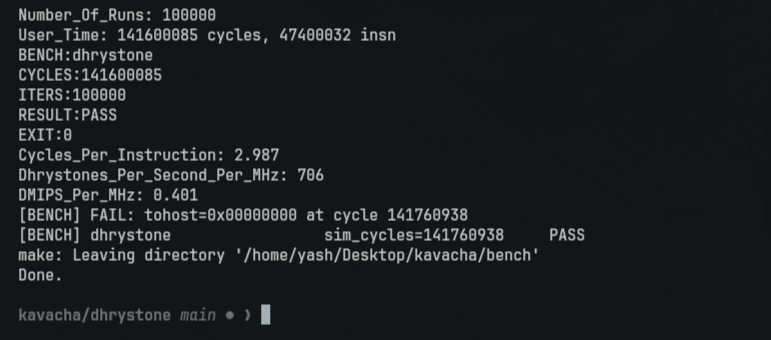
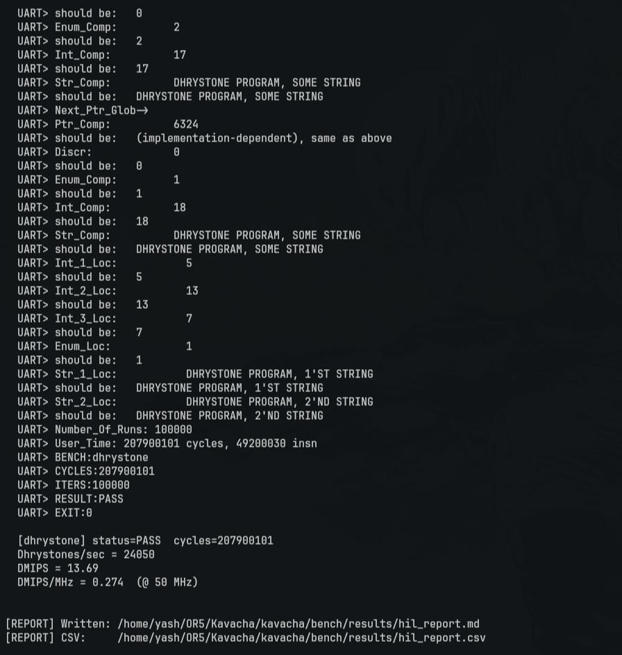

# Dhrystone v2.1 Evaluation Suite for Kavacha

This document details the toolchain, compiler options, execution parameters, score calculations, and hardware benchmark results for the **Kavacha** RISC-V (RV32IMC) processor core running the **Dhrystone v2.1** benchmark.

---

## Toolchain & Environment

Dhrystone is built using the project's bundled GNU RISC-V toolchain with bare-metal freestanding optimization flags:

| Setting | Value |
|---------|-------|
| **Primary Toolchain** | `xPack GNU RISC-V Embedded GCC 13.2.0` (`riscv-none-elf-gcc`) |
| **Fallback Toolchain** | `riscv64-elf-gcc` / `riscv64-unknown-elf-gcc` (GCC 13+ / 15+) |
| **Target Architecture** | `-march=rv32imc_zicsr` |
| **Target ABI** | `-mabi=ilp32` |
| **Optimization Level** | `-O2` |
| **Simulation Engine** | `Verilator 5.018+` (cycle-accurate C++ RTL model) |
| **Target Hardware** | Digilent Arty A7-100T (Xilinx Artix-7 `xc7a100tcsg324-1`) @ 50 MHz |

### Compiler Flags

```bash
-march=rv32imc_zicsr -mabi=ilp32 \
-O2 \
-ffreestanding \
-ffunction-sections \
-fdata-sections \
-fno-builtin \
-fno-common \
-Wall \
-nostdlib \
-nostartfiles \
-std=gnu99 \
-DNUM_RUNS=100000 \
-DTIME \
-DRISCV \
-Wno-implicit-int \
-Wno-return-type \
-Wno-implicit-function-declaration
```

### Linker Flags

```bash
-T ../bench/common/bench.ld -Wl,--gc-sections -lgcc
```

---

## Execution Parameters

The industry-standard Dhrystone benchmark requires executing for at least 2 real-world seconds (≥ 100 million cycles for a 50 MHz core) to ensure statistically stable timing measurements:

- **Iterations (`NUM_RUNS`)**: **100,000** (executes for ~141M cycles on Kavacha, clearing the 2-second threshold)
- **Timeout**: 300,000,000 simulation cycles in Verilator

---

## Benchmark Results

All benchmark metrics are measured across 100,000 runs:

| Metric | Verilator Simulation | FPGA HIL (Arty A7 @ 50 MHz) |
|--------|:-------------------:|:---------------------------:|
| **Iterations** | 100,000 | 100,000 |
| **Benchmark Cycles (`User_Time`)** | **141,600,085** | **207,900,101** |
| **Instructions Executed** | **47,400,032** | — |
| **Cycles per Instruction (CPI)** | **2.987** | — |
| **Cycles / Iteration** | **1,416.0** | **2,079.0** |
| **Dhrystones / sec / MHz** | **706.2** | **481.0** |
| **DMIPS / MHz** | **0.401** | **0.274** |
| **Status** | ✅ PASS | ✅ PASS |

*(Note: Total simulation cycles including `crt0.S` boot initialization and exit sequence is `141,760,938` cycles).*

---

## Score Calculation Methodology

1. **Cycles per Iteration**:
   $$\text{Cycles / Iteration} = \frac{\text{Benchmark Cycles}}{\text{Iterations}} = \frac{141,600,085}{100,000} = 1,416.0$$

2. **Dhrystones per Second per MHz**:
   $$\text{Dhrystones / sec / MHz} = \frac{\text{Iterations} \times 1,000,000}{\text{Benchmark Cycles}} = \frac{100,000 \times 1,000,000}{141,600,085} = 706.214$$

3. **DMIPS / MHz** (Normalized against the VAX 11/780 baseline of 1,757 Dhrystones/sec):
   $$\text{DMIPS / MHz} = \frac{\text{Dhrystones / sec / MHz}}{1,757} = \frac{706.214}{1,757} = \mathbf{0.401 \text{ DMIPS/MHz}}$$

---

## Available Runner Scripts

- **`./run_dhrystone.sh`**:
  Compiles Dhrystone with `riscv-none-elf-gcc` (GCC 13.2.0), runs 100,000 iterations in Verilator simulation, validates string/pointer self-check outputs, and prints DMIPS metrics.

- **`./run_dhrystone_fpga.sh`**:
  Builds bare-metal FPGA firmware, runs automated hardware bitstream injection and execution on the physical Arty A7-100T board over UART, and records scores to `bench/results/hil_report.md`.

## Simulation Results



## FPGA Results

