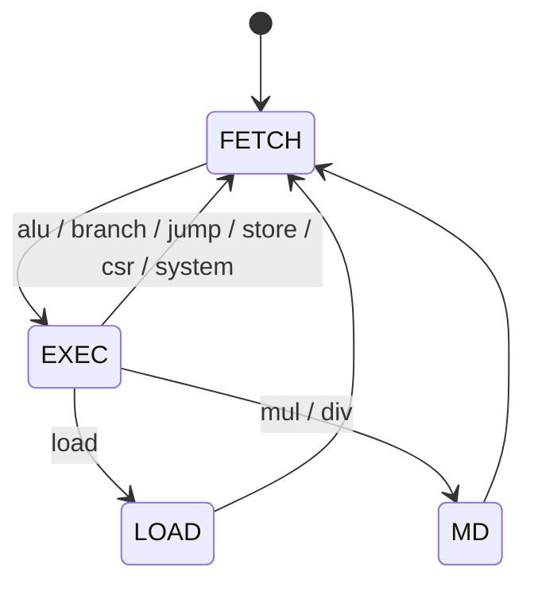
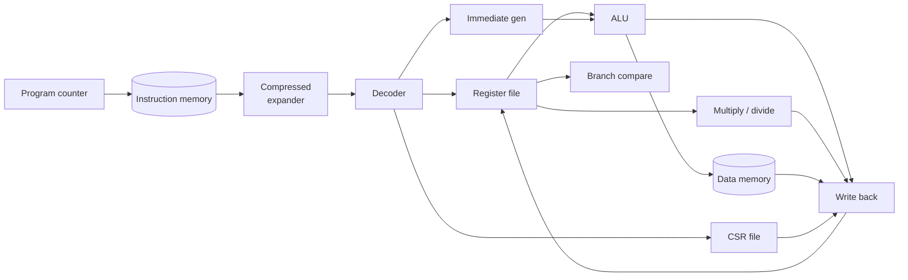

# Architecture

Kavacha is a **multi-cycle, non-pipelined** core. A single instruction is
fetched, executed to completion over a few clock cycles, and retired before the
next fetch begins. Because only one instruction is ever in flight, the design
needs **no pipeline registers, no operand forwarding, and no hazard detection**
— the classes of logic that dominate a pipelined core simply do not exist here.

## Execution model

Every instruction walks a short finite state machine:

| State | Work performed |
|-------|----------------|
| **FETCH** | present the PC to instruction memory; capture the instruction word (a 16-bit compressed halfword is expanded to its 32-bit form) |
| **EXEC** | decode, read the register file, compute the result or branch target, and — for most instructions — write back and advance the PC |
| **LOAD** | second beat for a load: capture data returning from memory and write it back |
| **MD** | iterate the multiply/divide unit to completion |

Most instructions therefore complete in the `FETCH → EXEC` path; loads and
multiply/divide take one additional state. Stores, branches, jumps, CSR and
system instructions all retire directly from `EXEC`.

## Datapath

The datapath is assembled from a set of small, independently verified **leaf
cells** kept under `rtl/common/`:

| Cell | Role |
|------|------|
| `gandiva_pkg.sv` | shared types, opcodes, and parameters |
| `gandiva_decode.sv` | instruction decoder |
| `gandiva_rvc.sv` | 16-bit compressed → 32-bit expander |
| `gandiva_immgen.sv` | immediate generation |
| `gandiva_alu.sv` | arithmetic / logic / shift unit |
| `gandiva_branch.sv` | branch condition evaluation |
| `gandiva_muldiv.sv` | iterative multiply and divide |
| `gandiva_regfile.sv` | 32 × 32-bit register file |
| `gandiva_regfile_ecc.sv` | register file with SECDED ECC |
| `gandiva_csr.sv` | machine/user CSR file with trap logic |
| `gandiva_pmp.sv` | Physical Memory Protection checker |

The core-specific logic — the control FSM, the memory sequencing, the debug
hooks, and the SoC and bus wrappers — lives in the `kavacha_*` modules under
`rtl/`. The leaf cells are shared, pre-verified building blocks; Kavacha wires
them into a multi-cycle control scheme.

## Register file semantics

The register file is **non-transparent**: a read in the same cycle as a write to
the same register returns the *old* value. Because Kavacha never reads and
writes the same architectural register in the same cycle (there is only one
instruction in flight), this has no functional effect and keeps the cell small.

## Memory interface

The core drives a simple synchronous memory port: an address, read/write
strobes, byte enables, and separate read- and write-data buses. A `mem_stall`
input lets memory or a bus bridge hold the core for multi-cycle latency; tie it
low for zero-latency tightly-coupled memory. Misaligned accesses that cross a
word boundary are performed as **two memory beats** and stitched together by the
core, so software sees a single misaligned load or store.

## Interrupts

Three interrupt lines — timer, software, and external — are sampled at
instruction boundaries. When an interrupt is taken, the core records the cause,
saves the return PC, and vectors through `mtvec`; `MRET` restores the previous
state. See **[Traps & Interrupts](traps-and-interrupts.md)** for details.
