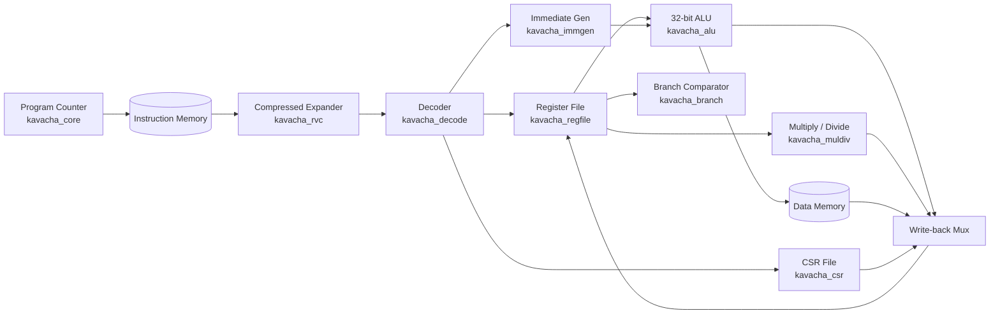

# Datapath & Leaf Cells

Kavacha features a modular, highly structured datapath built from independent, pre-verified **leaf cells** located under `rtl/common/`. 

The top-level core module (`rtl/kavacha_core.sv`) orchestrates these leaf cells using the central FSM control logic.

---

## Datapath Block Diagram



---

## Complete Leaf Cell Interfaces (`rtl/common/`)

### 1. RVC Compressed Expander (`kavacha_rvc.sv`)

Expands 16-bit compressed RISC-V instructions (`C` extension) into standard 32-bit instructions before decoding.

```verilog
module kavacha_rvc (
  input  logic [16:0] instr_i,   // 16-bit compressed instruction + alignment
  output logic [31:0] instr_o,   // Expanded 32-bit RISC-V instruction
  output logic        is_rvc_o,  // Asserted if input is a valid 16-bit RVC instruction
  output logic        illegal_o  // Asserted if 16-bit opcode is invalid
);
```

#### RVC Expansion Mapping Table

| Compressed Instruction | 16-bit Opcode Pattern | Expanded 32-bit Instruction Equivalent |
|------------------------|-----------------------|-----------------------------------------|
| `C.LWSP` | `3'b010, offset, rd` | `LW rd, offset(x2)` |
| `C.SWSP` | `3'b110, offset, rs2` | `SW rs2, offset(x2)` |
| `C.LW` | `3'b010, rs1', offset, rd'` | `LW rd', offset(rs1')` |
| `C.SW` | `3'b110, rs1', offset, rs2'` | `SW rs2', offset(rs1')` |
| `C.J` | `3'b101, offset` | `JAL x0, offset` |
| `C.JAL` (RV32) | `3'b001, offset` | `JAL x1, offset` |
| `C.JR` | `3'b100, 0, rs1, 0` | `JALR x0, 0(rs1)` |
| `C.JALR` | `3'b100, 1, rs1, 0` | `JALR x1, 0(rs1)` |
| `C.BEQZ` | `3'b110, rs1', offset` | `BEQ rs1', x0, offset` |
| `C.BNEZ` | `3'b111, rs1', offset` | `BNE rs1', x0, offset` |
| `C.LI` | `3'b010, rd, imm` | `ADDI rd, x0, imm` |
| `C.LUI` | `3'b011, rd, imm` | `LUI rd, imm[17:12]` |
| `C.ADDI` | `3'b000, rd, imm` | `ADDI rd, rd, imm` |
| `C.ADD` | `3'b100, 1, rd, rs2` | `ADD rd, rd, rs2` |
| `C.MV` | `3'b100, 0, rd, rs2` | `ADD rd, x0, rs2` |
| `C.ANDI` | `3'b100, 2'b10, rd', imm` | `ANDI rd', rd', imm` |
| `C.SUB` | `3'b100, 2'b11, 0, rd', rs2'` | `SUB rd', rd', rs2'` |
| `C.XOR` | `3'b100, 2'b11, 1, rd', rs2'` | `XOR rd', rd', rs2'` |
| `C.OR` | `3'b100, 2'b11, 2, rd', rs2'` | `OR rd', rd', rs2'` |
| `C.AND` | `3'b100, 2'b11, 3, rd', rs2'` | `AND rd', rd', rs2'` |
| `C.NOP` | `16'h0001` | `ADDI x0, x0, 0` |
| `C.EBREAK` | `16'h9002` | `EBREAK` |

---

### 2. Instruction Decoder (`kavacha_decode.sv`)

Extracts register addresses, immediates, and functional control flags from 32-bit instructions.

```verilog
module kavacha_decode (
  input  logic [31:0] instr_i,        // 32-bit instruction word
  output logic [4:0]  rs1_o,          // Source register 1 address
  output logic [4:0]  rs2_o,          // Source register 2 address
  output logic [4:0]  rd_o,           // Destination register address
  output alu_op_e     alu_op_o,       // ALU operation enum
  output branch_op_e  branch_op_o,    // Branch condition operation enum
  output imm_type_e   imm_type_o,     // Immediate field format
  output logic        rf_we_o,        // GPR write enable flag
  output logic        dmem_re_o,      // Memory read strobe
  output logic        dmem_we_o,      // Memory write strobe
  output logic        is_illegal_o    // Asserted if instruction is invalid
);
```

---

### 3. Immediate Generator (`kavacha_immgen.sv`)

Extracts and sign-extends immediate bitfields across all standard RISC-V formats.

```verilog
module kavacha_immgen (
  input  logic [31:0] instr_i,      // 32-bit instruction word
  input  imm_type_e   imm_type_i,   // Format: IMM_I, IMM_S, IMM_B, IMM_U, IMM_J
  output logic [31:0] imm_o         // Sign-extended 32-bit immediate output
);
```

#### Bitfield Extraction Logic
- **I-Type (`ADDI`, `LW`, `JALR`):** `imm_o = {{20{instr[31]}}, instr[31:20]}`
- **S-Type (`SW`, `SB`, `SH`):** `imm_o = {{20{instr[31]}}, instr[31:25], instr[11:7]}`
- **B-Type (`BEQ`, `BNE`, `BLT`):** `imm_o = {{19{instr[31]}}, instr[31], instr[7], instr[30:25], instr[11:8], 1'b0}`
- **U-Type (`LUI`, `AUIPC`):** `imm_o = {instr[31:12], 12'b0}`
- **J-Type (`JAL`):** `imm_o = {{11{instr[31]}}, instr[31], instr[19:12], instr[20], instr[30:21], 1'b0}`

---

### 4. Arithmetic Logic Unit (`kavacha_alu.sv`)

Executes 32-bit single-cycle arithmetic, logical operations, and barrel shifts.

```verilog
module kavacha_alu (
  input  alu_op_e     operator_i,  // ALU_ADD, ALU_SUB, ALU_AND, ALU_OR, ALU_XOR, ALU_SLL, ALU_SRL, ALU_SRA, ALU_SLT, ALU_SLTU
  input  logic [31:0] operand_a_i, // Operand A (rs1_data or PC)
  input  logic [31:0] operand_b_i, // Operand B (rs2_data or immediate)
  output logic [31:0] result_o,    // 32-bit ALU output
  output logic        zero_o       // High if result_o == 0
);
```

#### Barrel Shifter Implementation
* **Logical Left Shift (`SLL`):** `result_o = operand_a_i << operand_b_i[4:0]`
* **Logical Right Shift (`SRL`):** `result_o = operand_a_i >> operand_b_i[4:0]`
* **Arithmetic Right Shift (`SRA`):** `result_o = $signed(operand_a_i) >>> operand_b_i[4:0]` (preserves sign bit 31).

---

### 5. General-Purpose Register File (`kavacha_regfile.sv`)

32 × 32-bit register file storing architectural registers `x0` through `x31`.

```verilog
module kavacha_regfile #(
  parameter bit SECURE = 0
) (
  input  logic        clk,
  input  logic        rst_n,
  input  logic        we_i,          // Write enable
  input  logic [4:0]  waddr_i,       // Destination register address (rd)
  input  logic [31:0] wdata_i,       // Writeback data
  input  logic [4:0]  raddr1_i,      // Source register 1 address (rs1)
  output logic [31:0] rdata1_o,      // Read data 1
  input  logic [4:0]  raddr2_i,      // Source register 2 address (rs2)
  output logic [31:0] rdata2_o       // Read data 2
);
```

#### Synthesis & Hardware Optimization
* **Zero Register Hardwiring:** Register `x0` is hardwired to `32'h00000000`. Writes to `waddr_i == 5'b00000` are automatically ignored (`we_i & (waddr_i != 0)`).
* **Non-Transparent Semantics:** A read and write to the same register in the same clock cycle returns the **old value**. Because Kavacha only has 1 instruction in flight, write-bypass multiplexers are unnecessary, allowing Vivado synthesis to infer compact LUT-RAM primitives (`RAM32M` on Xilinx Artix-7).
