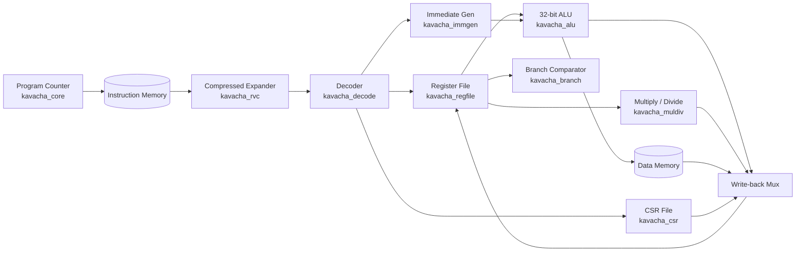

# Datapath & Leaf Cells

Kavacha features a modular, highly structured datapath built from independent, pre-verified **leaf cells** located under `rtl/common/`. 

The top-level core module (`rtl/kavacha_core.sv`) orchestrates these leaf cells using the central FSM control logic.

---

## Datapath Block Diagram



---

## Complete Leaf Cell Interfaces (`rtl/common/`)

### 1. RVC Compressed Expander (`kavacha_rvc.sv`)

Expands 16-bit compressed RISC-V instructions (`C` extension) into standard 32-bit instructions before decoding.

```verilog
module kavacha_rvc (
  input  logic [15:0] instr16,       // 16-bit compressed instruction halfword
  output logic [31:0] instr32,       // Expanded 32-bit RISC-V instruction
  output logic        is_compressed, // 1 if input is a valid 16-bit RVC instruction
  output logic        decomp_illegal // 1 if 16-bit opcode is invalid / reserved
);
```

#### RVC Expansion Mapping Table

| Compressed Instruction | 16-bit Opcode Pattern | Expanded 32-bit Instruction Equivalent |
|------------------------|-----------------------|-----------------------------------------|
| `C.LWSP` | `3'b010, offset, rd` | `LW rd, offset(x2)` |
| `C.SWSP` | `3'b110, offset, rs2` | `SW rs2, offset(x2)` |
| `C.LW` | `3'b010, rs1', offset, rd'` | `LW rd', offset(rs1')` |
| `C.SW` | `3'b110, rs1', offset, rs2'` | `SW rs2', offset(rs1')` |
| `C.J` | `3'b101, offset` | `JAL x0, offset` |
| `C.JAL` (RV32) | `3'b001, offset` | `JAL x1, offset` |
| `C.JR` | `3'b100, 0, rs1, 0` | `JALR x0, 0(rs1)` |
| `C.JALR` | `3'b100, 1, rs1, 0` | `JALR x1, 0(rs1)` |
| `C.BEQZ` | `3'b110, rs1', offset` | `BEQ rs1', x0, offset` |
| `C.BNEZ` | `3'b111, rs1', offset` | `BNE rs1', x0, offset` |
| `C.LI` | `3'b010, rd, imm` | `ADDI rd, x0, imm` |
| `C.LUI` | `3'b011, rd, imm` | `LUI rd, imm[17:12]` |
| `C.ADDI` | `3'b000, rd, imm` | `ADDI rd, rd, imm` |
| `C.ADD` | `3'b100, 1, rd, rs2` | `ADD rd, rd, rs2` |
| `C.MV` | `3'b100, 0, rd, rs2` | `ADD rd, x0, rs2` |
| `C.ANDI` | `3'b100, 2'b10, rd', imm` | `ANDI rd', rd', imm` |
| `C.SUB` | `3'b100, 2'b11, 0, rd', rs2'` | `SUB rd', rd', rs2'` |
| `C.XOR` | `3'b100, 2'b11, 1, rd', rs2'` | `XOR rd', rd', rs2'` |
| `C.OR` | `3'b100, 2'b11, 2, rd', rs2'` | `OR rd', rd', rs2'` |
| `C.AND` | `3'b100, 2'b11, 3, rd', rs2'` | `AND rd', rd', rs2'` |
| `C.NOP` | `16'h0001` | `ADDI x0, x0, 0` |
| `C.EBREAK` | `16'h9002` | `EBREAK` |

---

### 2. Instruction Decoder (`kavacha_decode.sv`)

Combinational decoder that extracts control signals from the (RVC-expanded) 32-bit instruction. This is the single source of truth for instruction decoding.

```verilog
module kavacha_decode
  import kavacha_pkg::*;
(
  input  logic [31:0]     instr,     // 32-bit instruction (already RVC-expanded)
  input  logic [XLEN-1:0] imm_i,     // I-type immediate (from kavacha_immgen)
  input  logic [XLEN-1:0] imm_s,     // S-type immediate
  input  logic [XLEN-1:0] imm_b,     // B-type immediate
  input  logic [XLEN-1:0] imm_u,     // U-type immediate
  input  logic [XLEN-1:0] imm_j,     // J-type immediate

  output alu_op_e         alu_op,    // ALU operation selector
  output br_op_e          br_op,     // Branch comparison selector
  output md_op_e          md_op,     // Multiply/divide operation
  output wb_sel_e         wb_sel,    // Writeback source (ALU/MEM/PC4/CSR/MD)
  output logic            use_pc,    // 1 = ALU operand A is PC (AUIPC)
  output logic            use_imm,   // 1 = ALU operand B is immediate
  output logic            reg_we,    // GPR write enable
  output logic            mem_re,    // Memory read strobe
  output logic            mem_we,    // Memory write strobe
  output logic            mem_unsigned, // 1 = zero-extend load (LBU/LHU)
  output logic [1:0]      mem_width, // 0=byte, 1=half, 2=word
  output logic            is_branch, is_jal, is_jalr, is_md, is_csr,
  output logic            is_ecall, is_ebreak, is_mret,
  output logic            illegal,   // Unrecognized instruction
  output logic            uses_rs2,  // 1 = rs2 field is architecturally used
  output logic [XLEN-1:0] id_imm     // Selected immediate for this instruction
);
```

Note: `rs1`, `rs2`, and `rd` fields are extracted as wires directly in `kavacha_core.sv` from `instr[19:15]`, `instr[24:20]`, and `instr[11:7]` respectively — they are NOT decoder outputs.

---

### 3. Immediate Generator (`kavacha_immgen.sv`)

Produces all five standard RISC-V immediate formats simultaneously. The decoder selects the correct one via `id_imm`.

```verilog
module kavacha_immgen (
  input  logic [31:0]     instr,  // 32-bit instruction word
  output logic [XLEN-1:0] imm_i,  // I-type: {{20{instr[31]}}, instr[31:20]}
  output logic [XLEN-1:0] imm_s,  // S-type: {{20{instr[31]}}, instr[31:25], instr[11:7]}
  output logic [XLEN-1:0] imm_b,  // B-type: sign-extended branch offset
  output logic [XLEN-1:0] imm_u,  // U-type: {instr[31:12], 12'b0}
  output logic [XLEN-1:0] imm_j   // J-type: sign-extended jump offset
);
```

#### Bitfield Extraction Logic
- **I-Type (`ADDI`, `LW`, `JALR`):** `imm_i = {{20{instr[31]}}, instr[31:20]}`
- **S-Type (`SW`, `SB`, `SH`):** `imm_s = {{20{instr[31]}}, instr[31:25], instr[11:7]}`
- **B-Type (`BEQ`, `BNE`, `BLT`):** `imm_b = {{19{instr[31]}}, instr[31], instr[7], instr[30:25], instr[11:8], 1'b0}`
- **U-Type (`LUI`, `AUIPC`):** `imm_u = {instr[31:12], 12'b0}`
- **J-Type (`JAL`):** `imm_j = {{11{instr[31]}}, instr[31], instr[19:12], instr[20], instr[30:21], 1'b0}`

---

### 4. Arithmetic Logic Unit (`kavacha_alu.sv`)

Combinational 32-bit ALU supporting all RV32I arithmetic, logical, and shift operations.

```verilog
module kavacha_alu
  import kavacha_pkg::*;
(
  input  alu_op_e          op,  // Operation selector enum
  input  logic [XLEN-1:0]  a,   // Operand A (rdata1 or PC)
  input  logic [XLEN-1:0]  b,   // Operand B (rdata2 or immediate)
  output logic [XLEN-1:0]  y    // 32-bit result
);
```

#### ALU Operation Map

| `alu_op_e` Value | Operation | SystemVerilog Logic |
|---|---|---|
| `ALU_ADD` | Addition | `y = a + b` |
| `ALU_SUB` | Subtraction | `y = a - b` |
| `ALU_SLL` | Logical Left Shift | `y = a << b[4:0]` |
| `ALU_SLT` | Set Less Than (Signed) | `y = ($signed(a) < $signed(b)) ? 1 : 0` |
| `ALU_SLTU` | Set Less Than (Unsigned) | `y = (a < b) ? 1 : 0` |
| `ALU_XOR` | Bitwise XOR | `y = a ^ b` |
| `ALU_SRL` | Logical Right Shift | `y = a >> b[4:0]` |
| `ALU_SRA` | Arithmetic Right Shift | `y = $signed(a) >>> b[4:0]` |
| `ALU_OR` | Bitwise OR | `y = a \| b` |
| `ALU_AND` | Bitwise AND | `y = a & b` |
| `ALU_PASS_B` | Pass Operand B (LUI) | `y = b` |

---

### 5. General-Purpose Register File (`kavacha_regfile.sv`)

32 × 32-bit register file storing architectural registers `x0` through `x31`.

```verilog
module kavacha_regfile
  import kavacha_pkg::*;
#(
  // WRITE_FIRST=1 enables write-before-read transparency (for pipelined cores).
  // Kavacha sets this to 0: multi-cycle cores must not form
  // a read->write->ALU->read combinational loop.
  parameter bit WRITE_FIRST = 1
)(
  input  logic              clk,
  input  logic [4:0]        ra1,   // Read address port 1 (rs1)
  input  logic [4:0]        ra2,   // Read address port 2 (rs2)
  output logic [XLEN-1:0]   rd1,   // Read data port 1
  output logic [XLEN-1:0]   rd2,   // Read data port 2
  input  logic              we,    // Write enable
  input  logic [4:0]        wa,    // Write address (rd)
  input  logic [XLEN-1:0]   wd     // Write data
);
```

#### Implementation Details
* **Zero Register Hardwiring:** Register `x0` is hardwired to `32'h00000000`. Writes to `wa == 5'd0` are ignored (`we && (wa != 5'd0)`).
* **`WRITE_FIRST` Parameter:** `kavacha_core` instantiates with `WRITE_FIRST(0)`. A read and write to the same register in the same clock cycle returns the **old value**, avoiding combinational loops in the multi-cycle datapath.
* **Two async read ports, one sync write port.** Initial register values are zero.

---

### 6. Branch Comparator (`kavacha_branch.sv`)

Evaluates branch condition codes for conditional branch instructions.

```verilog
module kavacha_branch
  import kavacha_pkg::*;
(
  input  br_op_e           br_op,  // Branch operation enum
  input  logic [XLEN-1:0]  a,      // rs1 data
  input  logic [XLEN-1:0]  b,      // rs2 data
  output logic              taken   // 1 = branch condition met
);
```

Supported operations: `BR_EQ`, `BR_NE`, `BR_LT`, `BR_GE`, `BR_LTU`, `BR_GEU`, `BR_NONE`.

---

### 7. Multiply / Divide Unit (`kavacha_muldiv.sv`)

Multi-cycle hardware unit for RV32M operations.

```verilog
module kavacha_muldiv
  import kavacha_pkg::*;
(
  input  logic              clk,
  input  logic              rst,
  input  logic              start,   // Pulse for 1 cycle to begin
  input  md_op_e            op,      // MD_MUL..MD_REMU
  input  logic [XLEN-1:0]  a,       // Operand A (rs1)
  input  logic [XLEN-1:0]  b,       // Operand B (rs2)
  output logic              busy,    // 1 while computing
  output logic              done,    // 1-cycle pulse when result is valid
  output logic [XLEN-1:0]  result   // Computation result
);
```

* **Multiply:** Combinational 33×33-bit signed product. Completes in **1 clock cycle** (S_MUL → done).
* **Division:** Iterative shift-subtract over 32 steps (`bit_idx` 31→0) + sign-fixup cycle (`S_FIN`). Takes **34 muldiv clocks**.
