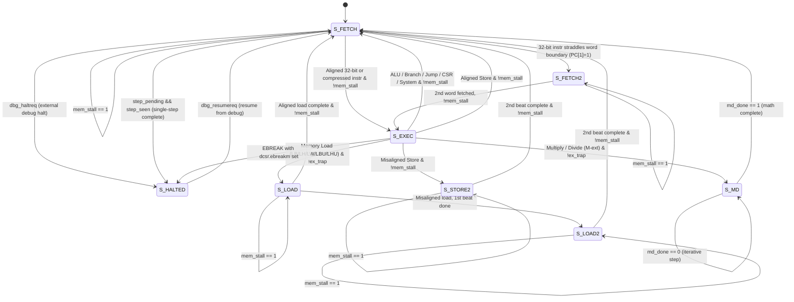

# Microarchitecture & Execution FSM

Kavacha is a **multi-cycle, non-pipelined** 32-bit RISC-V processor core (`kavacha_core.sv`). Rather than overlapping multiple instructions across pipeline stages, Kavacha executes **one instruction at a time** to completion through a central Finite State Machine (FSM). 

Because only a single instruction is ever in flight ($N_{\text{flight}} = 1$), the design completely eliminates:
- **Data hazards** (Read-After-Write RAW, Write-After-Read WAR, Write-After-Write WAW)
- **Operand forwarding and bypass multiplexers**
- **Control hazards, branch prediction units, and pipeline flushes**
- **Memory hazards and speculative execution side-channel vulnerabilities**

This multi-cycle control strategy minimizes silicon area, guarantees deterministic instruction execution timing, and simplifies formal verification (RVFI).

---

## FSM State Encoding & SystemVerilog Implementation

The FSM uses a **4-bit** state encoding with **7 defined states**. The state register updates on the positive edge of `clk` with synchronous active-high reset:

```verilog
// Central Control FSM State Definitions (kavacha_core.sv)
localparam logic [3:0] S_FETCH  = 4'd0;
localparam logic [3:0] S_EXEC   = 4'd1;
localparam logic [3:0] S_LOAD   = 4'd2;
localparam logic [3:0] S_MD     = 4'd3;
localparam logic [3:0] S_FETCH2 = 4'd4;  // 2nd word fetch for straddled 32-bit instrs
localparam logic [3:0] S_LOAD2  = 4'd5;  // 2nd memory beat for misaligned loads
localparam logic [3:0] S_STORE2 = 4'd6;  // 2nd memory beat for misaligned stores
localparam logic [3:0] S_HALTED = 4'd7;  // Debug halt mode (awaiting dbg_resumereq)
logic [3:0] state;

// Sequential FSM Register Update
always_ff @(posedge clk) begin
  if (rst) begin
    state <= S_FETCH;
  end else begin
    // Each state case handles mem_stall individually
    unique case (state)
      S_FETCH: if (!mem_stall) ...
      ...
    endcase
  end
end
```

### Complete FSM State Transition Diagram



---

## Detailed State Operations & Hardware Behavior

### 1. `S_FETCH` (Instruction Fetch)
* **Datapath Action:** Drives `imem_addr = pc`. The instruction memory presents the 32-bit word on `imem_rdata`.
* **Compressed Instruction Expansion (`RVC`):** The halfword at `pc` is selected by `pc[1]` — if `pc[1]=0`, `imem_rdata[15:0]` is used; if `pc[1]=1`, `imem_rdata[31:16]` is used. `kavacha_rvc` checks if it's a valid 16-bit compressed instruction and expands it to 32 bits.
* **Straddled 32-bit Instruction:** If `pc[1]=1` and the instruction is NOT compressed (32-bit), only the upper halfword is available in this word. The FSM saves `imem_rdata[31:16]` into `lo16` and transitions to `S_FETCH2` to fetch the next word containing the lower 16 bits.
* **Debug Halt:** If `dbg_haltreq` is asserted, the core saves `dpc <= pc`, records `dcsr_cause <= 3'd3`, and transitions to `S_HALTED` instead.
* **Transition:** Moves to `S_EXEC` once the full 32-bit instruction is assembled and `mem_stall` is low.

### 2. `S_FETCH2` (Straddled Instruction Fetch — 2nd Word)
* **Datapath Action:** Drives `imem_addr = {pc[31:2], 2'b00} + 4` to fetch the next word.
* **Instruction Assembly:** Combines `{imem_rdata[15:0], lo16}` to form the complete 32-bit instruction.
* **Transition:** Moves to `S_EXEC` when `mem_stall` is low.

### 3. `S_EXEC` (Decode, Read, Compute & Execute)
* **Datapath Action:**
  1. **Instruction Decode:** `kavacha_decode` extracts control signals from the assembled 32-bit instruction.
  2. **Register Read:** `kavacha_regfile` presents `rdata1` and `rdata2` for `rs1` and `rs2`.
  3. **Immediate Generation:** `kavacha_immgen` produces all five immediate formats (`imm_i`, `imm_s`, `imm_b`, `imm_u`, `imm_j`).
  4. **ALU & Branch Evaluation:** `kavacha_alu` computes `alu_y`; `kavacha_branch` evaluates `br_taken`.
  5. **CSR Access:** `kavacha_csr` executes atomic read-modify-write (`CSRRW`/`CSRRS`/`CSRRC`).
* **Retire / Writeback:**
  * **ALU / Logic / Shifts / Immediates:** Writeback data written via `rf_we`, PC updates (`pc <= next_pc`), instruction retires from `S_EXEC`.
  * **Jumps & Branches:** Calculates target PC; writes link address `pc + instr_len` (2 or 4) to `rd` if jump.
  * **Aligned Stores (`SB`/`SH`/`SW`):** Drives `dmem_addr`, `dmem_wdata`, `dmem_we`, `dmem_be`. Retires once `mem_stall` is low.
  * **Misaligned Stores:** First beat fires in `S_EXEC`, then transitions to `S_STORE2` for the second beat.
* **EBREAK → Debug:** If `dcsr_ebreakm` is set, `EBREAK` enters debug mode (`S_HALTED`) instead of trapping.

### 4. `S_LOAD` (Data Memory Read — 1st Beat)
* **Datapath Action:** Presents `dmem_addr = {alu_y[31:2], 2'b00}` with `dmem_re = 1`.
* **Aligned Load:** Samples `dmem_rdata`, applies byte/halfword alignment and sign/zero extension via the shift-based load assembly logic. Writes formatted data to register file, advances PC, transitions to `S_FETCH`.
* **Misaligned Load:** If the access crosses a word boundary (`mis` flag), captures `dmem_rdata` into `ld_w0` and transitions to `S_LOAD2`.

### 5. `S_LOAD2` (Misaligned Load — 2nd Beat)
* **Datapath Action:** Drives `dmem_addr = {alu_y[31:2], 2'b00} + 4` to read the next word.
* **Reassembly:** Combines `{dmem_rdata, ld_w0}` and shifts right by `aoff*8` bits to produce the final load value.
* **Transition:** Writes back to register file, advances PC, returns to `S_FETCH`.

### 6. `S_STORE2` (Misaligned Store — 2nd Beat)
* **Datapath Action:** Drives the upper portion of the store data to `dmem_addr + 4` with `dmem_be = be8[7:4]`.
* **Transition:** Advances PC and returns to `S_FETCH` when `mem_stall` is low.

### 7. `S_MD` (Iterative Hardware Multiply / Divide)
* **Start Signal:** The multiply/divide unit is started in `S_EXEC` via `start = (state==S_EXEC && d_is_md)`.
* **Multiply (MUL/MULH/MULHSU/MULHU):** Uses a combinational 33×33-bit signed multiply. The `S_MUL` internal state completes in **1 clock cycle**, so total execution is **3 system cycles** (FETCH→EXEC→MD→FETCH).
* **Division (DIV/DIVU/REM/REMU):** Iterative shift-subtract over 32 steps (`bit_idx` counts 31→0), plus a sign-fixup cycle (`S_FIN`). Total: **34 muldiv clocks** + FETCH + EXEC = **36 system cycles**.
* **Completion:** When `md_done` pulses high, captures `md_result`, writes to register file, updates PC, and returns to `S_FETCH`.

### 8. `S_HALTED` (Debug Halt Mode)
* **Entry:** Entered via external halt request (`dbg_haltreq`), single-step completion, or `EBREAK` with `dcsr.ebreakm` set.
* **Behavior:** Core is frozen. The debug module can read/write GPRs and CSRs via the Access-Register handshake (`dbg_ar_valid`/`dbg_ar_done`) and perform System Bus Access to memory.
* **Exit:** When `dbg_resumereq` pulses, the core restores `pc <= dpc`, clears `dbg_mode`, and returns to `S_FETCH`. If `dcsr.step` is set, `step_pending` is armed for single-step execution.

---

## Complete Control Signal Truth Table

| Signal | `S_FETCH` | `S_EXEC` (ALU/Branch) | `S_EXEC` (Store) | `S_LOAD` | `S_MD` | `S_HALTED` |
|--------|:---------:|:---------------------:|:-----------------:|:--------:|:------:|:----------:|
| `mem_req` | `1` | Depends | `1` | `1` | `0` | `0` |
| `dmem_re` | `0` | `0` | `0` | `1` | `0` | `0` |
| `dmem_we` | `0` | `0` | `1` | `0` | `0` | `0` |
| `rf_we` | `0` | `commit && d_reg_we && rd!=0` | `0` | On commit | On `md_done` | `0` |
| `commit` | `0` | `1` (if !load, !md) | `!mem_stall` | `!mem_stall` | `md_done` | `0` |

---

## Formal Proof of Zero Hazards

Because Kavacha operates strictly as a multi-cycle core with $N_{\text{flight}} = 1$:

1. **RAW (Read-After-Write) Hazards:** An instruction reading register $R_A$ in `S_EXEC` always reads the value written back by preceding instructions, because all previous instructions fully retired into `kavacha_regfile` in prior clock cycles.
2. **Control Hazards:** Branch and jump conditions are fully evaluated during `S_EXEC`, and `pc` is updated in the same cycle. The next `S_FETCH` always fetches from the correct target address — zero misprediction penalties or pipeline flushes.
3. **Structural Hazards:** Memory accesses for instruction fetch (`S_FETCH`) and data access (`S_EXEC`/`S_LOAD`) execute in separate, non-overlapping FSM cycles, allowing Kavacha to share a single unified memory bus without bus contention.

---

## Interrupt & Exception Handling Hooks

When an exception (`ECALL`, `EBREAK`, illegal instruction, PMP access fault) or interrupt (`MTIP`, `MSIP`, `MEIP`) occurs during `S_EXEC`:

1. **Writeback Suppression:** The `ex_trap` signal gates `rf_we` off, preventing register corruption.
2. **CSR Architectural State Update:** The CSR unit (`kavacha_csr`) captures the faulting PC into `mepc`, records the exception cause in `mcause`, stores fault information in `mtval`, saves `mstatus.MIE` into `mstatus.MPIE`, and clears `mstatus.MIE`.
3. **Interrupt Acceptance:** Interrupts are taken at instruction boundaries (`commit && irq_req && !ex_trap && !d_is_mret && !d_is_csr`). `mepc` is set to `seq_next` (the instruction that would have executed next).
4. **Vector Redirection:** The PC multiplexer selects `next_pc = mtvec_w`.
5. **FSM Reset to Fetch:** The FSM returns directly to `S_FETCH` to begin fetching from the trap vector address.
