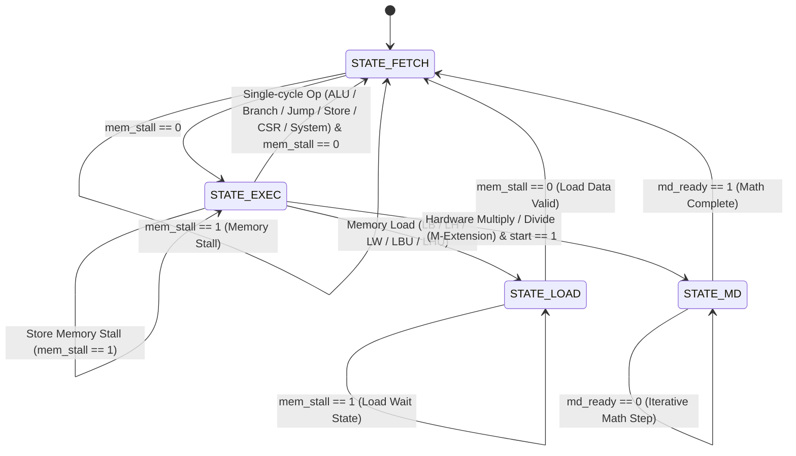

# Microarchitecture & Execution FSM

Kavacha is a **multi-cycle, non-pipelined** 32-bit RISC-V processor core (`kavacha_core.sv`). Rather than overlapping multiple instructions across pipeline stages, Kavacha executes **one instruction at a time** to completion through a central Finite State Machine (FSM). 

Because only a single instruction is ever in flight ($N_{\text{flight}} = 1$), the design completely eliminates:
- **Data hazards** (Read-After-Write RAW, Write-After-Read WAR, Write-After-Write WAW)
- **Operand forwarding and bypass multiplexers**
- **Control hazards, branch prediction units, and pipeline flushes**
- **Memory hazards and speculative execution side-channel vulnerabilities**

This multi-cycle control strategy minimizes silicon area, guarantees deterministic instruction execution timing, and simplifies formal verification (RVFI).

---

## FSM State Encoding & SystemVerilog Implementation

The FSM control unit evaluates state transitions on every positive edge of `clk` (unless held high by `mem_stall`). The state logic is encoded as a 2-bit SystemVerilog enumerated type:

```verilog
// Central Control FSM State Definitions (kavacha_core.sv)
typedef enum logic [1:0] {
  STATE_FETCH = 2'b00,  // Present PC to instruction memory; fetch instruction word
  STATE_EXEC  = 2'b01,  // Decode, read GPRs, compute ALU/Branch/Jump/CSR, store
  STATE_LOAD  = 2'b10,  // Capture memory read data, align, write back to GPR
  STATE_MD    = 2'b11   // Iterative 32-bit multiply and divide computation
} fsm_state_e;

fsm_state_e state_q, state_d;

// Sequential FSM Register Update
always_ff @(posedge clk or negedge rst_n) begin
  if (!rst_n) begin
    state_q <= STATE_FETCH;
  end else if (!mem_stall) begin
    state_q <= state_d;
  end
end
```

### Complete FSM State Transition Diagram



---

## Detailed State Operations & Hardware Behavior

### 1. `STATE_FETCH` (Instruction Fetch)
* **Datapath Action:** Drives `imem_addr = pc`. The instruction memory presents the 32-bit or compressed 16-bit instruction word on `imem_rdata`.
* **Compressed Instruction Expansion (`RVC`):** If `C` extension logic (`kavacha_rvc`) is active, 16-bit halfwords are captured and expanded into standard 32-bit RISC-V instructions before decoding.
* **Control Output:** `imem_req = 1`, `dmem_we = 0`, `rf_we = 0`, `csr_we = 0`.
* **Transition:** Moves to `STATE_EXEC` on the next clock cycle once `imem_rdata` is valid and `mem_stall` is low.

### 2. `STATE_EXEC` (Decode, Read, Compute & Execute)
* **Datapath Action:**
  1. **Instruction Decode:** `kavacha_decode` extracts `rs1`, `rs2`, `rd`, `opcode`, `funct3`, `funct7`, and instruction format flags.
  2. **Register Read:** `kavacha_regfile` presents `rs1_data` and `rs2_data`.
  3. **Immediate Generation:** `kavacha_immgen` sign-extends I-, S-, B-, U-, and J-type immediates.
  4. **ALU & Branch Evaluation:** `kavacha_alu` computes arithmetic/logic results; `kavacha_branch` evaluates branch condition codes (`BEQ`, `BNE`, `BLT`, etc.).
  5. **CSR Access:** `kavacha_csr` executes atomic read-modify-write operations (`CSRRW`, `CSRRS`, `CSRRC`).
* **Retire / Writeback:**
  * **ALU / Logic / Shifts / Immediates (`ADD`, `SUB`, `AND`, `OR`, `SLT`, `LUI`, `AUIPC`):** Writeback data written to `rf_wdata[rd]`, PC updates (`pc <= next_pc`), instruction retires directly from `STATE_EXEC`.
  * **Jumps & Branches (`JAL`, `JALR`, `BEQ`, etc.):** Calculates target PC (`pc <= branch_taken ? branch_target : pc + (is_rvc ? 2 : 4)`), writes return address to `rd` if jump, retires directly.
  * **Memory Stores (`SB`, `SH`, `SW`):** Drives `dmem_addr = alu_result`, `dmem_wdata = rs2_data`, `dmem_we = 1`, `dmem_be = byte_enable_mask`. Retires once `mem_stall` is low.

### 3. `STATE_LOAD` (Data Memory Read Beat)
* **Datapath Action:** Presents `dmem_addr = alu_result` to data memory with `dmem_re = 1`.
* **Alignment & Sign Extension:** Samples `dmem_rdata` when valid. Lower address bits (`alu_result[1:0]`) select byte/halfword alignment, followed by sign-extension (`LB`, `LH`) or zero-extension (`LBU`, `LHU`).
* **Writeback & Retire:** Writes formatted data to `rf_wdata[rd]`, advances `pc <= pc + (is_rvc ? 2 : 4)`, and transitions to `STATE_FETCH`.

### 4. `STATE_MD` (Iterative Hardware Multiply / Divide)
* **Datapath Action:** Asserts `md_start = 1` to trigger `kavacha_muldiv`.
* **Math Execution:** Iterates bit-by-bit over 32 clock cycles for division/remainder and up to 32 cycles for multiplication (depending on operand magnitude).
* **Completion:** When `md_ready == 1`, captures `md_result`, writes to `rf_wdata[rd]`, updates `pc`, and returns to `STATE_FETCH`.

---

## Complete Control Signal Matrix Across States

| Control Signal | `STATE_FETCH` | `STATE_EXEC` (ALU/Branch/Jump) | `STATE_EXEC` (Store) | `STATE_LOAD` | `STATE_MD` |
|----------------|:-------------:|:-----------------------------:|:-------------------:|:------------:|:----------:|
| `imem_req` | `1` | `0` | `0` | `0` | `0` |
| `dmem_re` | `0` | `0` | `0` | `1` | `0` |
| `dmem_we` | `0` | `0` | `1` | `0` | `0` |
| `rf_we` | `0` | `1` (if `rd != 0`) | `0` | `1` (on completion) | `1` (on `md_ready`) |
| `pc_write` | `0` | `1` (except load/MD) | `1` | `1` | `1` (on `md_ready`) |
| `csr_we` | `0` | `1` (if CSR instruction) | `0` | `0` | `0` |
| `md_start` | `0` | `1` (if M-extension) | `0` | `0` | `0` |
| `rvfi_valid` | `0` | `1` (single-cycle) | `1` | `1` | `1` (on `md_ready`) |

---

## Detailed Micro-Timing Diagrams

### 1. Single-Cycle Execution (ALU / Branch / Store / CSR) — 2 Cycles Total

```
CLK        :   _   / \   _   / \   _   / \   _   / \   
FSM State  : [  STATE_FETCH  ][  STATE_EXEC   ][  STATE_FETCH  ]
imem_addr  : [   0x00000000  ][   0x00000000  ][   0x00000004  ]
imem_rdata : [  ADD x1,x2,x3 ][  ADD x1,x2,x3 ][  SUB x4,x5,x6 ]
rf_we      : _________________[   HIGH (x1)   ]_________________
Retire (RVFI): _________________[   VALID HIGH  ]_________________
```

### 2. Memory Load Execution (3 Cycles Total)

```
CLK        :   _   / \   _   / \   _   / \   _   / \   _   
FSM State  : [  STATE_FETCH  ][  STATE_EXEC   ][  STATE_LOAD   ][  STATE_FETCH  ]
imem_addr  : [   0x00000004  ][   0x00000004  ][   0x00000004  ][   0x00000008  ]
dmem_addr  : _________________[   0x80001000  ][   0x80001000  ]_________________
dmem_re    : _________________[   HIGH        ][   HIGH        ]_________________
rf_we      : __________________________________[   HIGH (rd)   ]_________________
Retire (RVFI): __________________________________[   VALID HIGH  ]_________________
```

---

## Formal Proof of Zero Hazards

Because Kavacha operates strictly as a multi-cycle core with $N_{\text{flight}} = 1$:

1. **RAW (Read-After-Write) Hazards:** An instruction reading register $R_A$ in `STATE_EXEC` always reads the value written back by preceding instructions, because all previous instructions fully retired into `kavacha_regfile` in prior clock cycles.
2. **Control Hazards:** Branch and jump conditions are fully evaluated during `STATE_EXEC`, and `pc` is updated in the same cycle. The next `STATE_FETCH` always fetches from the correct target address — zero misprediction penalties or pipeline flushes.
3. **Structural Hazards:** Memory accesses for instruction fetch (`STATE_FETCH`) and data access (`STATE_EXEC`/`STATE_LOAD`) execute in separate, non-overlapping FSM cycles, allowing Kavacha to share a single unified memory bus without bus contention.

---

## Interrupt & Exception Handling Hooks

When an exception (`ECALL`, `EBREAK`, illegal instruction, misaligned access) or interrupt (`MTIP`, `MSIP`, `MEIP`) occurs during `STATE_EXEC`:

1. **Writeback Suppression:** The FSM forcibly suppresses register file writeback (`rf_we <= 0`).
2. **CSR Architectural State Update:** The CSR unit (`kavacha_csr`) captures the faulting PC into `mepc`, records the exception cause in `mcause`, stores fault information in `mtval`, and saves previous privilege state in `mstatus`.
3. **Vector Redirection:** The PC multiplexer selects `next_pc = mtvec`.
4. **FSM Reset to Fetch:** The FSM returns directly to `STATE_FETCH` to begin fetching from the vector address.
