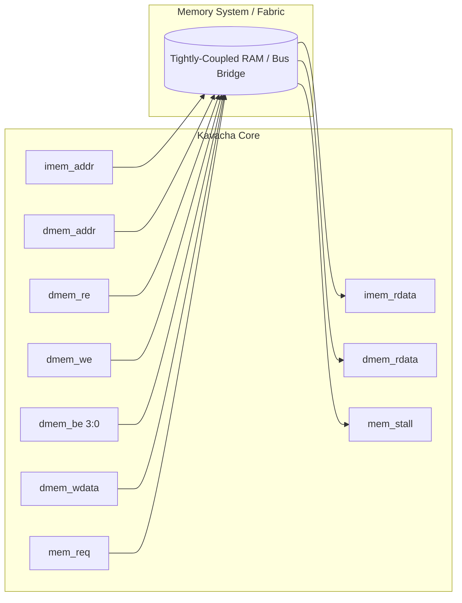

# Memory Interface & Alignment

Kavacha communicates with memory through a synchronous, native memory interface (`kavacha_core.sv`). This interface supports zero-latency tightly-coupled memories (TCM), sub-word byte enables, and hardware-managed misaligned memory accesses.

---

## Native Memory Interface Signal Map



### Complete Interface Signal Specifications

| Signal Name | Direction | Bit Width | Description |
|-------------|:---------:|:---------:|-------------|
| `imem_addr` | Output | 32 | Instruction fetch address (word/halfword aligned) |
| `imem_rdata` | Input | 32 | Instruction fetch read data bus |
| `dmem_addr` | Output | 32 | Data load/store access target address |
| `dmem_re` | Output | 1 | Data memory read strobe (active high during `STATE_LOAD`) |
| `dmem_we` | Output | 1 | Data memory write strobe (active high during `STATE_EXEC` store) |
| `dmem_be[3:0]` | Output | 4 | Byte enable strobes for byte, halfword, and word stores |
| `dmem_wdata` | Output | 32 | Store data bus (aligned to target byte lane) |
| `dmem_rdata` | Input | 32 | Load data bus returned from memory |
| `mem_req` | Output | 1 | Active high when a memory request (`IMEM` or `DMEM`) is active |
| `mem_stall` | Input | 1 | Hold signal from memory; freezes FSM state while high |

---

## Byte Enables & Sub-Word Access Alignment

Kavacha is **little-endian**. Sub-word stores (`SB`, `SH`) compute the 4-bit byte enable mask (`dmem_be`) based on the lower address bits `dmem_addr[1:0]`:

| Store Type | `dmem_addr[1:0]` | Active Bytes | `dmem_be[3:0]` | `dmem_wdata[31:0]` Placement |
|------------|:----------------:|:------------:|:--------------:|------------------------------|
| **`SB` (Byte)** | `2'b00` | Byte 0 | `4'b0001` | `{24'b0, rs2_data[7:0]}` |
| **`SB` (Byte)** | `2'b01` | Byte 1 | `4'b0010` | `{16'b0, rs2_data[7:0], 8'b0}` |
| **`SB` (Byte)** | `2'b10` | Byte 2 | `4'b0100` | `{8'b0, rs2_data[7:0], 16'b0}` |
| **`SB` (Byte)** | `2'b11` | Byte 3 | `4'b1000` | `{rs2_data[7:0], 24'b0}` |
| **`SH` (Halfword)** | `2'b00` | Bytes 0, 1 | `4'b0011` | `{16'b0, rs2_data[15:0]}` |
| **`SH` (Halfword)** | `2'b10` | Bytes 2, 3 | `4'b1100` | `{rs2_data[15:0], 16'b0}` |
| **`SW` (Word)** | `2'b00` | Bytes 0..3 | `4'b1111` | `rs2_data[31:0]` |

### Shift-Based Byte Enable Logic (`kavacha_core.sv`)

The actual RTL computes byte enables using a unified shift approach based on `d_mem_width` (0=byte, 1=half, 2=word) and the address offset `aoff = alu_y[1:0]`:

```verilog
// Unified byte enable: base mask shifted by address offset (kavacha_core.sv)
wire [1:0] aoff = alu_y[1:0];
wire [7:0] be8  = (((d_mem_width==2'd0) ? 8'h01 :
                    (d_mem_width==2'd1) ? 8'h03 : 8'h0F)) << aoff;

// For aligned stores: lower 4 bits; for misaligned 2nd beat: upper 4 bits
assign dmem_be = (state==S_STORE2) ? be8[7:4] :
                 (is_store_ex)     ? be8[3:0] : 4'b0000;
```

Store data is similarly shifted into the correct byte lanes:

```verilog
wire [31:0] st_val = (d_mem_width==2'd0) ? {24'b0, rdata2[7:0]} :
                     (d_mem_width==2'd1) ? {16'b0, rdata2[15:0]} : rdata2;
wire [63:0] st_sh  = {32'b0, st_val} << {aoff, 3'b000};  // << aoff*8
assign dmem_wdata  = (state==S_STORE2) ? st_sh[63:32] : st_sh[31:0];
```

---

## Load Data Formatting & Sign Extension

For load operations (`STATE_LOAD`), the core aligns returned data according to `dmem_addr[1:0]` and applies sign- or zero-extension:

* **`LB` (Load Byte, Signed):** Selects byte from lane `dmem_addr[1:0]`, sign-extends bit 7 across bits 31..8.
* **`LBU` (Load Byte, Unsigned):** Selects byte from lane `dmem_addr[1:0]`, zero-extends bits 31..8.
* **`LH` (Load Halfword, Signed):** Selects halfword from lane `dmem_addr[1]`, sign-extends bit 15 across bits 31..16.
* **`LHU` (Load Halfword, Unsigned):** Selects halfword from lane `dmem_addr[1]`, zero-extends bits 31..16.
* **`LW` (Load Word):** Passes 32-bit word directly to register file writeback.

---

## Hardware Misaligned Access Handling

Unlike cores that raise a misaligned load/store exception, Kavacha supports **misaligned memory accesses in hardware**. 

When a 16-bit or 32-bit load/store crosses a 32-bit word boundary (e.g. `LW` at address `0x1003`):

```
Word Boundary Crossing (e.g. 32-bit LW at 0x1003):
Address 0x1000: [ B0 ][ B1 ][ B2 ][ B3* ]  -> Beat 1: Capture Byte 3
Address 0x1004: [ B4*][ B5*][ B6*][ B7  ]  -> Beat 2: Capture Bytes 4, 5, 6
Result Word   : { B6, B5, B4, B3 }
```

### Execution Steps for Misaligned Accesses
1. **Beat 1 (Lower Word):** FSM drives `dmem_addr = {alu_y[31:2], 2'b00}`, reads/writes lower bytes, and saves the first word into an internal holding register (`ld_w0`).
2. **Beat 2 (Upper Word):** FSM drives `dmem_addr = {alu_y[31:2], 2'b00} + 4`, reads/writes upper bytes.
3. **Reassembly:** The two words are combined as `{dmem_rdata, ld_w0}` and shifted right by `aoff*8` bits, then width-extracted to produce the final load value.

This multi-beat handling is completely transparent to software — no trap handler overhead or `mtval` exception processing is required.

---

## AXI4-Lite Bridge Handshake (`mem_stall` Interaction)

When Kavacha connects to an AXI4-Lite bus fabric via `kavacha_axil_master.sv`:

```
CLK        :  _  / \  _  / \  _  / \  _  / \  _  
dmem_re    : [      HIGH       ]_________________
ARVALID    : [      HIGH       ]_________________
ARREADY    : ___________[ HIGH ]_________________
RVALID     : ___________________[ HIGH ]_________
mem_stall  : _____[ STALL HIGH ]_____[ LOW ]_____
FSM State  : [ LOAD ][ FROZEN  ][ LOAD ][ FETCH ]
```

1. Core issues `dmem_re = 1` during `STATE_LOAD`.
2. `kavacha_axil_master` asserts `mem_stall = 1` to freeze the core until the AXI4-Lite read handshake completes (`ARVALID & ARREADY` followed by `RVALID`).
3. Once `RVALID` returns data, `mem_stall` drops low, allowing the core to capture read data and transition back to `STATE_FETCH`.
