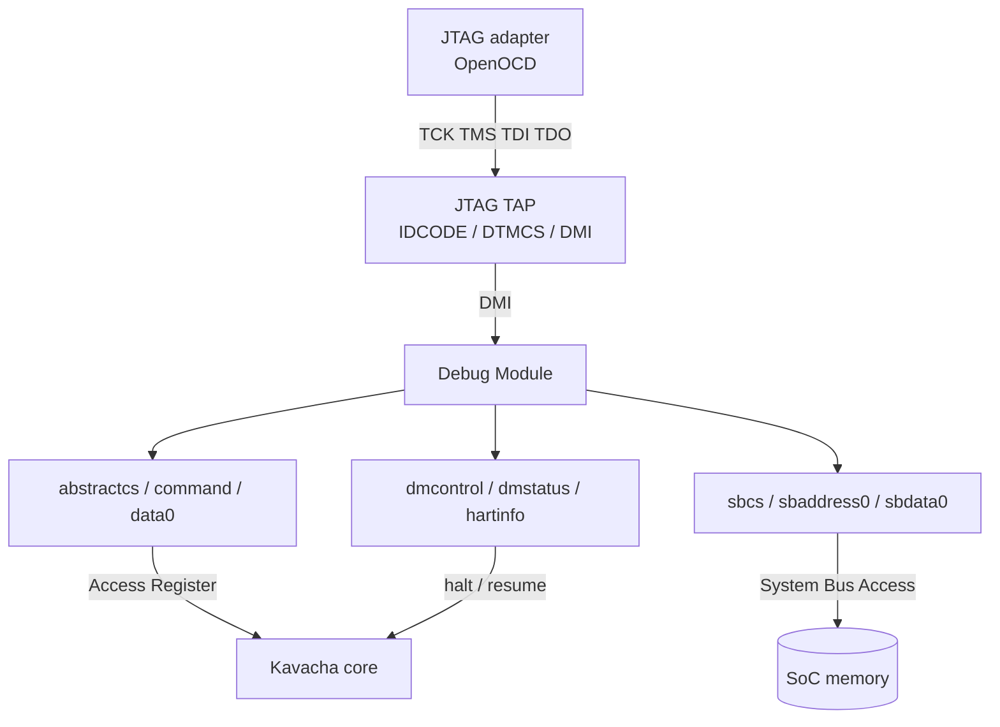

# Debug

Kavacha implements **RISC-V External Debug (Debug Specification 0.13.2)**. The
reference SoC instantiates a JTAG **Debug Transport Module (DTM)** and a **Debug
Module (DM)** that standard tools — OpenOCD and GDB — drive without custom
glue.

## Structure



## Capabilities

| Operation | Mechanism |
|-----------|-----------|
| Halt / resume the hart | `dmcontrol.haltreq` / `resumereq` |
| Report run/halt state | `dmstatus` |
| Read/write GPRs | Access-Register abstract command |
| Read/write CSRs | Access-Register abstract command |
| Read/write memory | System Bus Access (`sbcs`/`sbaddress0`/`sbdata0`) |
| Single-step | step control via the Debug Module |
| Enter debug on `EBREAK` | breakpoint redirects into debug mode |

## Clocking

The transport runs in the **core clock domain** by oversampling `TCK` with a
two-flop synchroniser and rising-edge detector. `TCK` must be much slower than
the core clock — true of any real JTAG adapter — which keeps the whole design
single-clock: fully synthesizable and directly co-simulable with the core, with
no asynchronous DMI clock-domain-crossing FIFO required.

## Connecting a debugger

1. Wire the SoC's JTAG pins (`tck`, `tms`, `tdi`, `tdo`) to your adapter. Tie
   them low if debug is unused.
2. Point OpenOCD at the DTM (IDCODE / DMI) with a RISC-V debug configuration.
3. Attach GDB to OpenOCD to halt, inspect registers and memory, set
   breakpoints, single-step, and resume.

## Self-check

The `debug` build target exercises the Debug Module end-to-end in simulation:

```bash
./build.sh debug
```

It halts the hart, reads a GPR through the Access-Register command, single-steps
one instruction, and confirms the core re-halts — printing `DEBUG: PASS`.
