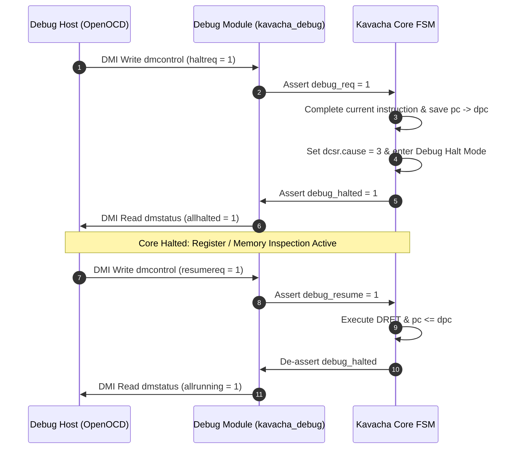

# Debug Module (DM) Registers & Control

The **Debug Module (DM)** (`kavacha_debug.sv`) resides between the JTAG Debug Transport Module (DTM) and the Kavacha CPU core. It implements the standard RISC-V Debug 0.13.2 register map to enable core halting, resuming, register file access, and arbitrary memory inspection.

---

## 1. Complete Debug Module (DM) Register Address Map

All registers below are accessed by reading and writing over the 40-bit DMI bus:

| DMI Address | Register Name | Access | Reset Value | Functional Description |
|:-----------:|---------------|:------:|:-----------:|------------------------|
| `0x04` | **`data0`** | RW | `32'h0` | Abstract Command Data Register 0 (holds write payload or read return value). |
| `0x05` | **`data1`** | RW | `32'h0` | Abstract Command Data Register 1 (used for 64-bit data or memory addresses). |
| `0x10` | **`dmcontrol`** | RW | `32'h0` | **DM Control Register:** Controls core halt (`haltreq`), resume (`resumereq`), and reset (`ndmreset`). |
| `0x11` | **`dmstatus`** | RO | `32'h0000_0C82` | **DM Status Register:** Reports core state (`allhalted`, `allrunning`, `resumeack`). |
| `0x16` | **`abstractcs`**| RW | `32'h0` | **Abstract CS:** Reports command execution errors (`cmderr`) and busy state (`busy`). |
| `0x17` | **`command`** | WO | `32'h0` | **Abstract Command Register:** Writing triggers abstract register or memory access commands. |
| `0x18` | **`abstractauto`**| RW | `32'h0` | Enables automatic re-execution of abstract commands on `data0` access. |
| `0x20` | **`progbuf0`** | RW | `32'h0` | **Program Buffer 0:** Holds 32-bit RISC-V instruction for debug execution. |
| `0x21` | **`progbuf1`** | RW | `32'h0` | **Program Buffer 1:** Holds second 32-bit instruction or `EBREAK`. |

---

## 2. Core Control Flow: Halting & Resuming



---

## 3. Key DM Register Bitfield Maps

### `dmcontrol` Register (`0x10`)

```
dmcontrol Layout (0x10):
 31 30 29 28               1   0
| haltreq | resumereq | Res | ndmreset | dmactive |
```

* **`dmactive` (bit 0):** `1` = Debug Module active, `0` = Debug Module reset.
* **`ndmreset` (bit 1):** Write `1` to force non-debug system reset of core and peripherals.
* **`resumereq` (bit 30):** Write `1` to request core to resume execution from `dpc`.
* **`haltreq` (bit 31):** Write `1` to request core to halt execution.

### `dmstatus` Register (`0x11`)

```
dmstatus Layout (0x11):
 31               18 17 16 15 14 13 12 11 10 9 8 7 0
|     Reserved      | resumeack | allhalted | allrunning | Res | version |
```

* **`version[3:0]`:** `4'h2` (RISC-V Debug Spec 0.13.2).
* **`allrunning` (bit 10):** `1` = Core is currently running code normally.
* **`allhalted` (bit 9):** `1` = Core is currently halted in Debug Mode.
* **`resumeack` (bit 17):** `1` = Core acknowledges resume request.

---

## 4. Abstract Commands & Register Inspection

To read or write architectural registers (`x0`–`x31`) or CSRs while halted:

### Reading Register `x5` (t0) into Host
1. Write target register encoding to `command` (`0x17`):
   * `cmdtype = 8'h00` (Access Register)
   * `transfer = 1`, `write = 0` (Read)
   * `regno = 16'h1005` (Register `x5`)
2. Poll `abstractcs.busy` until `0`.
3. Read returned 32-bit register value from `data0` (`0x04`).

### Register Address (`regno`) Map
* `0x1000` – `0x101F`: General-Purpose Registers `x0` through `x31`.
* `0x0000` – `0x0FFF`: CSRs (e.g. `0x0300` for `mstatus`, `0x0341` for `mepc`).

---

## 5. Program Buffer Execution (`progbuf`)

For arbitrary memory access or complex debug sequences:

1. Host writes RISC-V instructions into `progbuf0` (`0x20`) and `progbuf1` (`0x21`):
   * `progbuf0` = `32'h00052023` (`SW x5, 0(x10)`)
   * `progbuf1` = `32'h00100073` (`EBREAK`)
2. Host writes `command` with `postexec = 1`.
3. The core executes the instructions in Debug Mode and returns to halt state upon hitting `EBREAK`.
