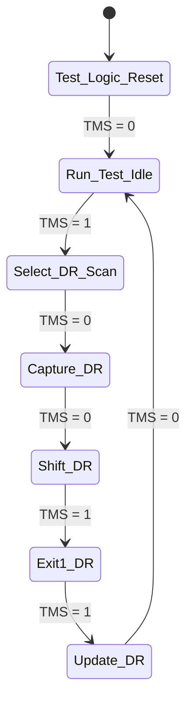

# RISC-V External Debug 0.13.2 & JTAG DTM

Kavacha integrates an on-chip **RISC-V External Debug 0.13.2** subsystem (`kavacha_debug.sv`) comprising an IEEE 1149.1 JTAG TAP controller, Debug Transport Module (DTM), and Debug Module (DM).

This allows hardware debug tools (OpenOCD, GDB, SEGGER J-Link) to halt the core, inspect/modify register files and memory, single-step instructions, and trigger hardware breakpoints over a 4-wire JTAG interface.

---

## 1. Debug Subsystem Architecture

```mermaid
flowchart LR
    subgraph External [External Debug Host]
        GDB[GDB / OpenOCD Host]
    end
    
    subgraph JTAG_Pins [JTAG Pins]
        TCK[jtag_tck]
        TMS[jtag_tms]
        TDI[jtag_tdi]
        TDO[jtag_tdo]
    end
    
    subgraph Core_Debug [Kavacha Debug Subsystem (kavacha_debug.sv)]
        TAP[IEEE 1149.1 TAP Controller]
        DTM[Debug Transport Module<br/>dtmcs / dmi]
        DM[Debug Module<br/>dmcontrol / dmstatus / abstractcs]
    end
    
    subgraph Core_CPU [Kavacha CPU Core]
        CPU[kavacha_core]
    end
    
    GDB <----> JTAG_Pins
    TCK --> TAP
    TMS --> TAP
    TDI --> TAP
    TAP --> TDO
    TAP <----> DTM
    DTM <---->|DMI Bus (40-bit)| DM
    DM <---->|Halt / Resume / Abstract Reg| CPU
```

---

## 2. JTAG Instruction Registers (IR Map)

The JTAG TAP Instruction Register (IR) is **5 bits wide**:

| IR Opcode | Name | DR Width | Description / Function |
|:---------:|:----:|:--------:|------------------------|
| `5'h01` | **`IDCODE`** | 32 bits | Returns manufacturer identification code (`32'h1000_1001`). |
| `5'h10` | **`DTMCS`** | 32 bits | **DTM Control and Status Register:** Reports DTM version, DMI bus status, and address width. |
| `5'h11` | **`DMI`** | 40 bits | **Debug Module Interface:** Reads and writes Debug Module (DM) registers over a 40-bit serial packet. |
| `5'h1F` | **`BYPASS`** | 1 bit | Standard IEEE 1149.1 1-bit bypass register. |

---

## 3. DTMCS Register (`0x10`) Bitfields

The `dtmcs` register configures and reports DTM operation status:

```
dtmcs DR Register Layout:
 31             18 17 16 15  14 12 11   10 9  4 3    0
|    Reserved     | err | res | idle | dmistat | abits | version |
```

| Bit Field | Name | Access | Reset Value | Description |
|:---------:|:----:|:------:|:-----------:|-------------|
| **3:0** | `version` | RO | `4'h1` | Identifies RISC-V Debug Specification version **0.13.2**. |
| **9:4** | `abits` | RO | `6'd6` | Number of address bits in DMI bus transactions ($2^6 = 64$ DM registers). |
| **11:10** | `dmistat` | RO | `2'b00` | DMI Status: `00` = No error, `01` = Reserved, `10` = Op failed, `11` = Busy. |
| **16** | `dmireset`| WO | `1'b0` | Write `1` to clear `dmistat` error flags. |

---

## 4. Debug Module Interface (DMI) Bus Packet Format (`0x11`)

The DMI register is a **40-bit shift register** that encapsulates DMI address, data, and operation payload:

```
40-bit DMI Shift Register Packet:
 39         34 33                                      2 1  0
|  Address[5:0] |               Data[31:0]              | Op |
```

### DMI Operation Codes (`Op`)

* **Shift In (Host → DTM):**
  * `2'b00` (**NOP**): No operation.
  * `2'b01` (**READ**): Read DM register at `Address[5:0]`.
  * `2'b10` (**WRITE**): Write `Data[31:0]` to DM register at `Address[5:0]`.
* **Shift Out (DTM → Host):**
  * `2'b00` (**SUCCESS**): Operation completed clean.
  * `2'b10` (**FAILED**): Operation rejected by DM.
  * `2'b11` (**BUSY**): Operation still processing.

---

## 5. TAP Controller State Machine (`kavacha_debug.sv`)

The 16-state IEEE 1149.1 state machine controls register capturing and shifting on `jtag_tck`:



1. **`Capture-DR`:** Captures DM register read payload into the 40-bit DMI shift register.
2. **`Shift-DR`:** Shifts TDO data out to OpenOCD/GDB bit-by-bit while shifting TDI data in.
3. **`Update-DR`:** Latches `Address[5:0]` and `Data[31:0]` to trigger DM register write.
