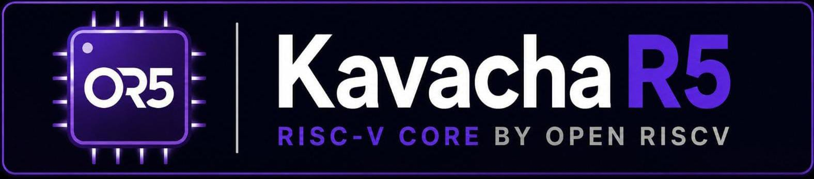

# Kavacha

  

**Kavacha** (*"armour"*) is a compact, area-optimized **RV32IMC** processor
core. It executes one instruction at a time through a small multi-cycle finite
state machine — no pipeline, no forwarding, and no hazard logic — which keeps
the design tiny, easy to reason about, and straightforward to verify.

Kavacha targets embedded and control-plane roles where silicon area, power, and
predictability matter more than peak throughput: microcontrollers, boot and
platform-management engines, deeply embedded state machines, and FPGA soft
cores.

---

## At a glance

| Property | Value |
|----------|-------|
| ISA | RV32IMC + Zicsr |
| Register width (XLEN) | 32-bit |
| Microarchitecture | multi-cycle FSM, non-pipelined |
| Instructions in flight | one (no hazards by construction) |
| Privilege modes | Machine; optional User (`SECURE`) |
| Memory protection | optional 8-region PMP + ePMP |
| Register file | plain, or SECDED ECC (`SECURE`) |
| Interrupts | timer, software, external |
| Misaligned load/store | supported in hardware |
| Debug | RISC-V External Debug 0.13.2 (JTAG DTM + DM) |
| Buses | native memory port + AXI4-Lite |
| Verification | golden co-simulation, RVFI, self-checks |

## Feature overview

- **Complete RV32IMC.** The base integer set, hardware multiply and divide
  (`M`), and 16-bit compressed instructions (`C`), plus the `Zicsr`
  control-and-status extension for trap handling and machine state.
- **Multi-cycle simplicity.** A single instruction moves through a short FSM,
  so there is nothing to forward and no hazard to detect. Behaviour is easy to
  follow, and correctness is easy to establish.
- **Precise traps and interrupts.** Exceptions (`ECALL`, `EBREAK`, illegal
  instruction, misaligned access), `MRET`, and timer / software / external
  interrupt lines are all handled precisely.
- **Optional security tier.** The `SECURE` configuration adds a User privilege
  mode, an 8-region Physical Memory Protection unit with ePMP semantics, and a
  register file protected by SECDED ECC.
- **Standard debug.** A JTAG Debug Transport Module and RISC-V Debug Module let
  OpenOCD and GDB halt, resume, single-step, inspect registers and CSRs, and
  read or write memory over the system bus.
- **SoC-ready.** A minimal native memory interface for tightly-coupled memories,
  and an AXI4-Lite wrapper for drop-in integration into standard fabrics.
- **Thoroughly verified.** Every build is checked against a golden RV32IM ISA
  model, exposes an RVFI port for formal analysis, and ships self-checking
  testbenches for the core, the debug module, and the ECC register file.

## Where to go next

- New here? Start with **[Getting Started](getting-started.md)** to build and
  run the core.
- Want the internals? See **[Architecture](architecture.md)** and the
  **[Instruction Set](isa.md)**.
- Integrating Kavacha into a design? See **[Memory Map](memory-map.md)**,
  **[Bus Integration](bus-integration.md)**, and **[Configuration
  Reference](configuration.md)**.
- Bringing it up on hardware? See **[FPGA Bring-up](fpga.md)**.
