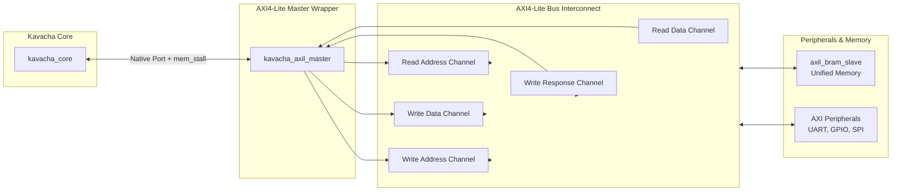
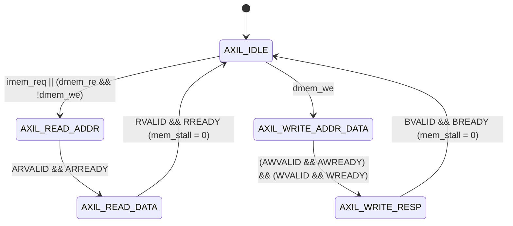

# AXI4-Lite Master Wrapper

Kavacha provides an industrial-standard **AMBA AXI4-Lite Master Wrapper** (`rtl/kavacha_axil.sv`) that translates native core memory requests into standard AXI4-Lite bus transactions. 

This enables Kavacha to drop into standard SoC interconnect fabrics (Xilinx SmartConnect, AXI Interconnect, ARM AMBA fabrics) and share memory and peripherals with other bus masters.

---

## 1. AXI4-Lite Subsystem Architecture



---

## 2. AXI4-Lite Signal Interface Map

`kavacha_axil_master.sv` implements all 5 standard AXI4-Lite channel groups:

| AXI Channel | Signal Name | Direction | Bit Width | Functional Description |
|-------------|-------------|:---------:|:---------:|------------------------|
| **Write Address** | `m_axil_awaddr` | Output | 32 | Target write memory address |
| | `m_axil_awprot` | Output | 3 | Protection signals (`3'b000` = Unprivileged/Normal) |
| | `m_axil_awvalid` | Output | 1 | Write address valid strobe |
| | `m_axil_awready` | Input | 1 | Slave write address acknowledge |
| **Write Data** | `m_axil_wdata` | Output | 32 | Write data payload |
| | `m_axil_wstrb` | Output | 4 | Write byte strobes (`dmem_be[3:0]`) |
| | `m_axil_wvalid` | Output | 1 | Write data valid strobe |
| | `m_axil_wready` | Input | 1 | Slave write data acknowledge |
| **Write Response**| `m_axil_bresp` | Input | 2 | Write response status (`2'b00` = OKAY, `2'b10` = SLVERR) |
| | `m_axil_bvalid` | Input | 1 | Write response valid strobe |
| | `m_axil_bready` | Output | 1 | Master write response acknowledge |
| **Read Address** | `m_axil_araddr` | Output | 32 | Target read memory address |
| | `m_axil_arprot` | Output | 3 | Protection signals |
| | `m_axil_arvalid` | Output | 1 | Read address valid strobe |
| | `m_axil_arready` | Input | 1 | Slave read address acknowledge |
| **Read Data** | `m_axil_rdata` | Input | 32 | Read data payload returned from slave |
| | `m_axil_rresp` | Input | 2 | Read response status (`2'b00` = OKAY) |
| | `m_axil_rvalid` | Input | 1 | Read data valid strobe |
| | `m_axil_rready` | Output | 1 | Master read data acknowledge |

---

## 3. Master Translation FSM (`kavacha_axil_master.sv`)

Because Kavacha operates with $N_{\text{flight}} = 1$, `kavacha_axil_master` issues **one outstanding AXI transaction at a time**, stalling the core via `mem_stall` until the complete AXI channel handshake finishes.



### SystemVerilog Handshake Logic
```verilog
// AXI4-Lite Read Transaction Initiator (kavacha_axil_master.sv)
always_comb begin
  m_axil_arvalid = (state_q == AXIL_READ_ADDR);
  m_axil_araddr  = (dmem_re) ? dmem_addr : imem_addr;
  m_axil_rready   = (state_q == AXIL_READ_DATA);
  
  // Assert mem_stall to freeze core FSM during active AXI transactions
  mem_stall_o    = (state_q != AXIL_IDLE) || imem_req_i || dmem_re_i || dmem_we_i;
end
```

---

## 4. Timing Waveforms

### AXI4-Lite Read Handshake

```
CLK      :  _  / \  _  / \  _  / \  _  / \  
dmem_re  : [      HIGH       ]_____________
ARVALID  : [      HIGH       ]_____________
ARREADY  : ___________[ HIGH ]_____________
RVALID   : ___________________[ HIGH ]_____
RREADY   : ___________________[ HIGH ]_____
mem_stall: _____[ STALL HIGH ]_____[ LOW ]_
```

### AXI4-Lite Write Handshake

```
CLK      :  _  / \  _  / \  _  / \  _  / \  
dmem_we  : [      HIGH       ]_____________
AWVALID  : [      HIGH       ]_____________
WVALID   : [      HIGH       ]_____________
AWREADY  : ___________[ HIGH ]_____________
WREADY   : ___________[ HIGH ]_____________
BVALID   : ___________________[ HIGH ]_____
BREADY   : ___________________[ HIGH ]_____
mem_stall: _____[ STALL HIGH ]_____[ LOW ]_
```

---

## 5. Modules Provided in `rtl/kavacha_axil.sv`

1. **`kavacha_axil_master`:** Wraps `kavacha_core` and converts native memory requests into AXI4-Lite master channel signals.
2. **`axil_bram_slave`:** AXI4-Lite slave wrapper housing unified instruction/data BRAM and `tohost` simulation handshake decoder.
3. **`kavacha_axil_soc`:** Complete reference SoC connecting master and slave over 5 AXI4-Lite channels.
