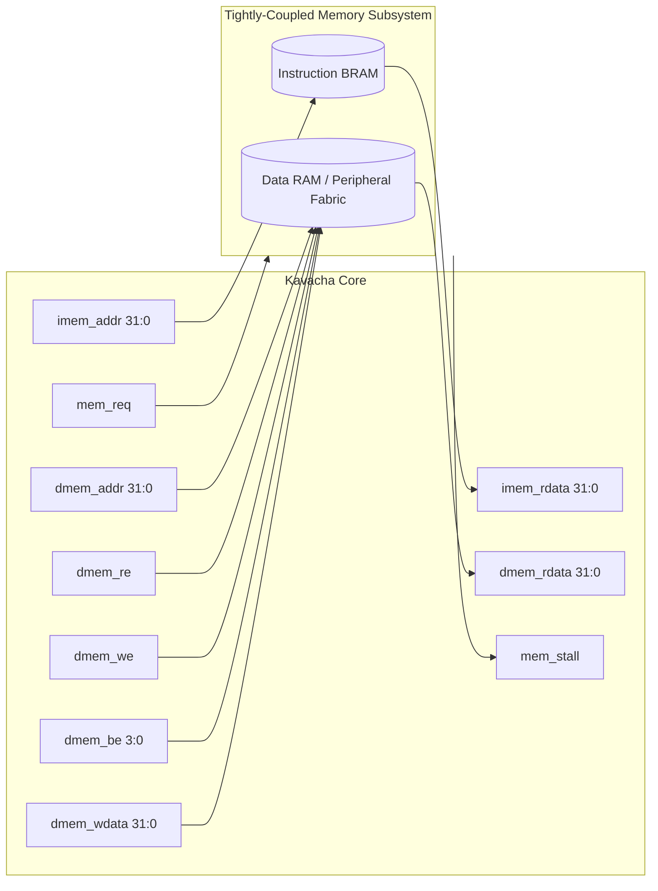

# Native Synchronous Memory Port

Kavacha features a minimal, synchronous native memory interface (`kavacha_core.sv`) designed for zero-latency connection to tightly-coupled memories (TCM), on-chip block RAMs (BRAM), distributed LUT-RAMs, and custom memory controllers.

---

## 1. Native Memory Port Signal Specification



### Complete Interface Signal Table

| Signal Name | Direction | Bit Width | Drive Clock | Functional Description |
|-------------|:---------:|:---------:|:-----------:|------------------------|
| `clk` | Input | 1 | — | Core primary clock |
| `rst_n` | Input | 1 | — | Active-low asynchronous reset |
| `imem_addr` | Output | 32 | `clk` (pos) | Target instruction fetch address |
| `imem_rdata` | Input | 32 | `clk` (pos) | Fetched instruction word returned from memory |
| `dmem_addr` | Output | 32 | `clk` (pos) | Target data memory access address |
| `dmem_re` | Output | 1 | `clk` (pos) | Data memory read strobe (asserted during `STATE_LOAD`) |
| `dmem_we` | Output | 1 | `clk` (pos) | Data memory write strobe (asserted during `STATE_EXEC` store) |
| `dmem_be` | Output | 4 | `clk` (pos) | Active byte lane enables (`dmem_be[3:0]`) for sub-word writes |
| `dmem_wdata` | Output | 32 | `clk` (pos) | Store data payload (aligned to target byte lane) |
| `dmem_rdata` | Input | 32 | `clk` (pos) | Load data word returned from memory |
| `mem_req` | Output | 1 | `clk` (pos) | Asserted high whenever an active memory transaction is in flight |
| `mem_stall` | Input | 1 | — | Hold signal from memory fabric; freezes core FSM when high |

---

## 2. SystemVerilog Port Declaration (`rtl/kavacha_core.sv`)

```verilog
module kavacha_core #(
  parameter logic [31:0] RESET_PC = 32'h0000_0000,
  parameter bit          SECURE   = 0
) (
  input  logic        clk,
  input  logic        rst_n,

  // Instruction Memory Port
  output logic [31:0] imem_addr,
  input  logic [31:0] imem_rdata,

  // Data Memory Port
  output logic [31:0] dmem_addr,
  output logic        dmem_re,
  output logic        dmem_we,
  output logic [3:0]  dmem_be,
  output logic [31:0] dmem_wdata,
  input  logic [31:0] dmem_rdata,

  // Memory Control Handshake
  output logic        mem_req,
  input  logic        mem_stall,

  // Hardware Interrupt Lines
  input  logic        timer_irq,
  input  logic        soft_irq,
  input  logic        ext_irq
);
```

---

## 3. Tightly-Coupled BRAM Integration (`kavacha_soc.sv`)

For zero-latency memory performance (`mem_stall = 0`), instruction and data RAMs are instantiated as synchronous dual-port Block RAMs:

```verilog
// Synchronous Dual-Port Memory BRAM Inferencing (kavacha_soc.sv)
logic [31:0] mem [0:MEM_WORDS-1];

// Firmware Image Initialisation
initial begin
  $readmemh("firmware.mem", mem);
end

// Instruction Fetch Port (Zero Latency)
always_ff @(posedge clk) begin
  imem_rdata <= mem[imem_addr[31:2]];
end

// Data Memory Port with Byte Enables
always_ff @(posedge clk) begin
  if (dmem_we) begin
    if (dmem_be[0]) mem[dmem_addr[31:2]][ 7: 0] <= dmem_wdata[ 7: 0];
    if (dmem_be[1]) mem[dmem_addr[31:2]][15: 8] <= dmem_wdata[15: 8];
    if (dmem_be[2]) mem[dmem_addr[31:2]][23:16] <= dmem_wdata[23:16];
    if (dmem_be[3]) mem[dmem_addr[31:2]][31:24] <= dmem_wdata[31:24];
  end
  dmem_rdata <= mem[dmem_addr[31:2]];
end
```

---

## 4. Wait-State Handshake Protocol (`mem_stall`)

When interfacing with slower external memories or bus bridges:

1. The core drives `mem_req = 1` alongside `imem_addr` or `dmem_addr`.
2. If memory requires extra clock cycles to access data, it asserts `mem_stall = 1`.
3. The core FSM freezes its state registers (`state_q`, `pc_q`, `rf_q`), preserving internal state.
4. Once memory places valid data on `imem_rdata` or `dmem_rdata`, it drops `mem_stall = 0`.
5. The core captures data on the next rising edge of `clk` and advances the FSM.

```
CLK        :   _   / \   _   / \   _   / \   _   / \   
dmem_addr  :  [      0x80001000       ]
dmem_re    :  [      HIGH             ]
mem_stall  :  ________[  STALL HIGH   ]________
FSM State  :  [ LOAD ][ LOAD (Frozen) ][ FETCH ]
```
