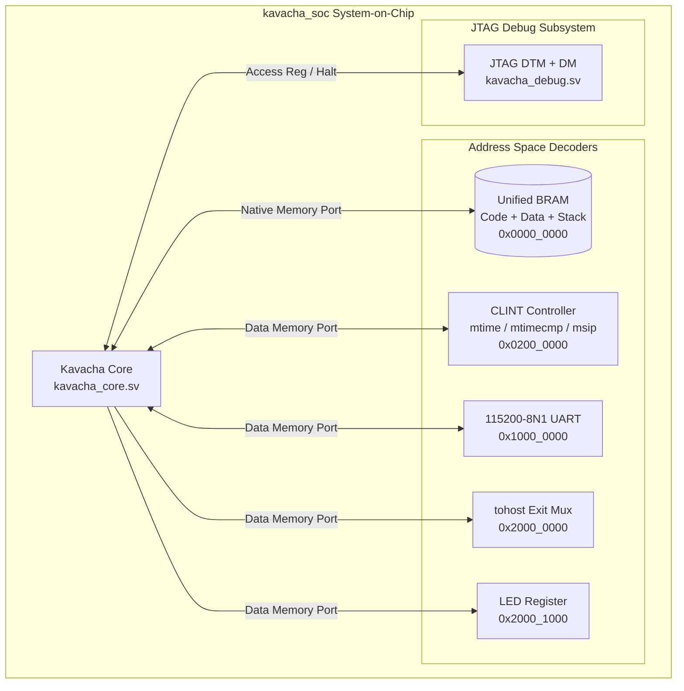

# Reference SoC Top (kavacha_soc)

The reference System-on-Chip top module (**`rtl/kavacha_soc.sv`**) integrates the Kavacha core with unified BRAM memory, CLINT timer/software interrupt subsystem, synthesizable UART console, simulation `tohost` exit handshake logic, and RISC-V JTAG Debug Module.

---

## 1. Reference SoC Block Architecture



---

## 2. SoC System Address Map

| Memory Region | Address Range | Size / Depth | Access | Functional Description |
|---------------|---------------|:------------:|:------:|------------------------|
| **Unified RAM** | `0x0000_0000` – `0x0001_FFFF` | 128 KB (32K Words) | R / W / X | Main memory (code, initialized data, BSS, and stack). Loaded from `firmware.mem`. |
| **CLINT** | `0x0200_0000` – `0x0200_FFFF` | 64 KB | R / W | Core Local Interruptor: `msip` (`0x0200_0000`), `mtimecmp` (`0x0200_4000`), `mtime` (`0x0200_BFF8`). |
| **UART Console** | `0x1000_0000` | 4 Bytes | R / W | Synthesizable 115200-8N1 console output (`txdata` / `rxdata`). |
| **`tohost` Exit** | `0x2000_0000` | 4 Bytes | W | Simulation control word. A store here terminates testbenches with `PASS` / `FAIL`. |
| **LED Register** | `0x2000_1000` | 4 Bytes | W | Low 8 bits (`[7:0]`) drive physical FPGA user LEDs. |

---

## 3. SystemVerilog Top-Level Module Interface (`rtl/kavacha_soc.sv`)

```verilog
module kavacha_soc #(
  parameter logic [31:0] RESET_PC    = 32'h0000_0000,
  parameter int          IMEM_WORDS  = 8192,
  parameter int          DRAM_WORDS  = 8192,
  parameter logic [31:0] DRAM_BASE   = 32'h8000_0000,
  parameter logic [31:0] TOHOST_ADDR = 32'h2000_0000,
  parameter bit          SECURE      = 0
) (
  input  logic        clk,
  input  logic        rst_n,

  // JTAG External Debug Interface
  input  logic        jtag_tck,
  input  logic        jtag_tms,
  input  logic        jtag_tdi,
  output logic        jtag_tdo,

  // Hardware Status & Simulation Outputs
  output logic [31:0] tohost_out,
  output logic        pass_o,
  output logic        fail_o,
  output logic [7:0]  leds_o
);
```

---

## 4. `tohost` Simulation Exit Handshake Protocol

For automated testbenches and regression scripts (`build.sh`), `kavacha_soc` implements the standard `tohost` exit protocol:

```verilog
// tohost Decoder Logic (kavacha_soc.sv)
always_ff @(posedge clk or negedge rst_n) begin
  if (!rst_n) begin
    tohost_out <= '0;
    pass_o     <= 1'b0;
    fail_o     <= 1'b0;
  end else if (dmem_we && (dmem_addr == TOHOST_ADDR)) begin
    tohost_out <= dmem_wdata;
    if (dmem_wdata == 32'h0000_0001) begin
      pass_o <= 1'b1;  // Writes 0x1 -> TEST PASS
    end else if (dmem_wdata > 32'h0000_0001) begin
      fail_o <= 1'b1;  // Writes > 0x1 -> TEST FAIL (Exit code = dmem_wdata >> 1)
    end
  end
end
```

---

## 5. Build Parameters & Instantiation Options

| Parameter Name | Default Value | Description |
|----------------|:-------------:|-------------|
| `RESET_PC` | `32'h0000_0000` | Address of the first instruction fetched following reset |
| `IMEM_WORDS` | `8192` (32 KB) | Instruction BRAM depth in 32-bit words |
| `DRAM_WORDS` | `8192` (32 KB) | Data BRAM depth in 32-bit words |
| `TOHOST_ADDR` | `32'h2000_0000` | Address of the `tohost` simulation handshake word |
| `SECURE` | `0` | `1` enables User mode + 8-region PMP/ePMP + SECDED ECC |
