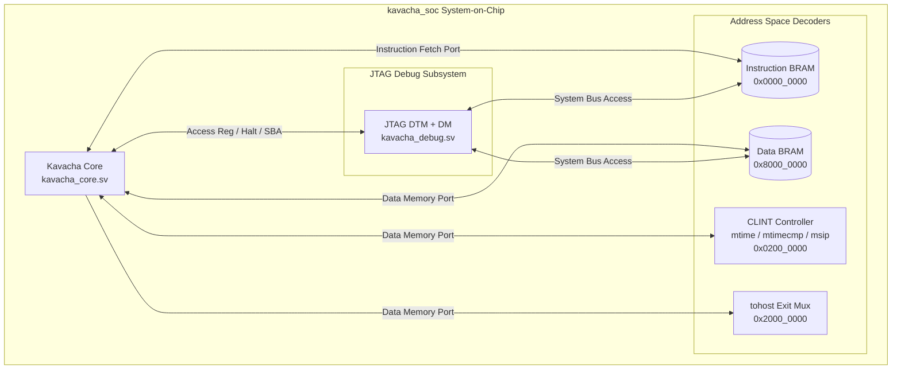

# Reference SoC Top (kavacha_soc)

The reference System-on-Chip top module (**`rtl/kavacha_soc.sv`**) integrates the Kavacha core with separate instruction and data BRAM memories, a CLINT timer/software interrupt subsystem, `tohost` simulation exit handshake, and the RISC-V JTAG Debug Module.

---

## 1. Reference SoC Block Architecture



---

## 2. SoC System Address Map

| Memory Region | Address Range | Default Depth | Access | Description |
|---------------|---------------|:-------------:|:------:|-------------|
| **Instruction BRAM** | `0x0000_0000` – `0x0000_7FFF` | 8192 words (32 KB) | R / X | Instruction memory. Loaded from `firmware.mem` via `$readmemh`. Also readable as data (for constant pools). |
| **CLINT** | `0x0200_0000` – `0x0200_FFFF` | — | R / W | Core Local Interruptor: `msip` (`0x0200_0000`), `mtimecmp` (`0x0200_4000..4004`), `mtime` (`0x0200_BFF8..BFFC`). |
| **`tohost` Exit** | `0x2000_0000` | 1 word | W | Simulation control word. A store here sets the `tohost` output and pulses `tohost_we`. |
| **Data BRAM** | `0x8000_0000` – `0x8000_7FFF` | 8192 words (32 KB) | R / W | Data memory for initialized data, BSS, heap, and stack. Byte-enable writes supported. |

---

## 3. SystemVerilog Top-Level Module Interface (`rtl/kavacha_soc.sv`)

```verilog
module kavacha_soc
  import kavacha_pkg::*;
#(
  parameter bit [31:0] IMEM_WORDS = 8192,
  parameter bit [31:0] DRAM_WORDS = 8192,
  parameter logic [XLEN-1:0] DRAM_BASE   = 32'h8000_0000,
  parameter logic [XLEN-1:0] TOHOST_ADDR = 32'h2000_0000,
  parameter bit SECURE = 1'b0  // -DKAVACHA_SECURE overrides to 1
)(
  input  logic        clk,
  input  logic        rst,        // Synchronous active-high reset

  // JTAG External Debug Interface
  input  logic        tck,
  input  logic        tms,
  input  logic        tdi,
  output logic        tdo,

  // Simulation & Status Outputs
  output logic [XLEN-1:0] tohost,     // Last value written to TOHOST_ADDR
  output logic            tohost_we,  // 1-cycle pulse on tohost write
  output logic            retire_valid,
  output logic [XLEN-1:0] retire_pc,
  output logic [XLEN-1:0] retire_instr,
  output logic            retire_rd_we,
  output logic [4:0]      retire_rd,
  output logic [XLEN-1:0] retire_rd_val
);
```

---

## 4. CLINT (Core Local Interruptor)

The SoC includes a standard CLINT with a free-running 64-bit `mtime` counter, a 64-bit `mtimecmp` comparator, and a software interrupt bit `msip`:

| Register | Address | Width | Reset | Function |
|----------|---------|:-----:|:-----:|----------|
| `msip` | `0x0200_0000` | 1 bit (bit 0) | `0` | Software interrupt pending. Write `1` to assert `irq_soft`. |
| `mtimecmp` (lo) | `0x0200_4000` | 32 bits | `0xFFFFFFFF` | Lower 32 bits of timer compare value. |
| `mtimecmp` (hi) | `0x0200_4004` | 32 bits | `0xFFFFFFFF` | Upper 32 bits of timer compare value. |
| `mtime` (lo) | `0x0200_BFF8` | 32 bits | `0` | Lower 32 bits of free-running counter. |
| `mtime` (hi) | `0x0200_BFFC` | 32 bits | `0` | Upper 32 bits of free-running counter. |

Timer interrupt fires when `mtime >= mtimecmp`. `mtime` increments by 1 every clock cycle.

---

## 5. `tohost` Simulation Exit Protocol

For automated testbenches and regression scripts (`build.sh`), `kavacha_soc` exposes the `tohost` output:

```verilog
// tohost Capture Logic (kavacha_soc.sv)
always_ff @(posedge clk) begin
  tohost_we_r <= 1'b0;
  if (dmem_we && (dmem_addr == TOHOST_ADDR)) begin
    tohost_r    <= dmem_wdata;
    tohost_we_r <= 1'b1;
  end
end
```

The testbench monitors `tohost_we` and inspects the `tohost` value:
* `tohost == 1` → **PASS** (test completed successfully)
* `tohost > 1` → **FAIL** (exit code = `tohost >> 1`)

---

## 6. Debug Module Integration

The SoC instantiates `kavacha_debug` which provides:

* **Hart Control:** `dbg_haltreq` / `dbg_resumereq` / `dbg_halted` for halt/resume
* **Access Register:** GPR and CSR read/write via abstract commands while halted
* **System Bus Access:** Independent memory read/write path (`dm_mem_valid/ready/addr/wdata/rdata`) for reading and writing IMEM and DRAM while the core is halted
* **Non-Debug-Module Reset:** `ndmreset` resets the core without resetting the debug module itself (`core_rst = rst | ndmreset`)

The core ties `mem_stall = 1'b0` and `irq_ext = 1'b0` in the reference SoC (zero-latency BRAM, no external interrupt controller).

---

## 7. Build Parameters & Instantiation Options

| Parameter Name | Default Value | Description |
|----------------|:-------------:|-------------|
| `IMEM_WORDS` | `8192` (32 KB) | Instruction BRAM depth in 32-bit words |
| `DRAM_WORDS` | `8192` (32 KB) | Data BRAM depth in 32-bit words |
| `DRAM_BASE` | `32'h8000_0000` | Base address of data RAM |
| `TOHOST_ADDR` | `32'h2000_0000` | Address of the `tohost` simulation handshake word |
| `SECURE` | `0` (or `1` via `-DKAVACHA_SECURE`) | `1` enables User mode + 8-region PMP/ePMP + SECDED ECC |
