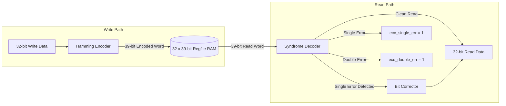

# SECDED ECC Register File

When compiled in the **SECURE** configuration (`SECURE = 1`), Kavacha replaces the standard register file with an error-resilient **SECDED (Single-Error Correction, Double-Error Detection) ECC Register File** (`kavacha_regfile_ecc.sv`).

This cell protects all 32 general-purpose registers (`x0`–`x31`) against **Single-Event Upsets (SEU)** caused by cosmic radiation, alpha particle strikes, or electromagnetic interference in radiation-sensitive and high-reliability environments.

---

## 1. Register Entry Width & Parity Layout

Each 32-bit register is stored alongside **7 Hamming check bits**, expanding the internal register width to **39 bits**:

```
39-bit ECC Register Storage Layout:
 38       32 31                                                  0
| Check Bits|                  32-Bit Data Word                   |
|  C6 .. C0 |                     D31 .. D0                       |
```

### Parity Math Parameters
* **Data Bits ($D$):** 32 bits
* **Parity Check Bits ($P$):** 6 Hamming bits ($2^6 = 64 \ge 32 + 6 + 1$)
* **Overall Parity Bit ($P_{\text{overall}}$):** 1 bit for double-error detection
* **Total Storage per GPR Entry:** $32 + 6 + 1 = \mathbf{39\text{ bits}}$

---

## 2. ECC Encoding & Read Correction Pipeline



---

## 3. Syndrome Calculation & Error Classification

On every register read cycle, the syndrome logic computes a 6-bit syndrome vector $S[5:0]$ and checks the overall parity bit $P_{\text{overall}}$:

$$S[i] = \text{Parity}_{\text{calculated}}[i] \oplus \text{Parity}_{\text{stored}}[i]$$

| Syndrome Vector ($S$) | Overall Parity | Status | Hardware Action |
|-----------------------|:--------------:|:------:|-----------------|
| $S = \text{6'b000000}$ | Match | **No Error** | Read data passed directly to execution datapath. |
| $S \ne \text{6'b000000}$ | Mismatch | **Single-Bit Error** | Bit index indicated by $S$ is flipped (`rdata[S] ^ 1'b1`). Corrected word passed to datapath; `ecc_single_err = 1` asserted. |
| $S \ne \text{6'b000000}$ | Match | **Double-Bit Error** | Uncorrectable double-bit corruption detected. `ecc_double_err = 1` asserted; triggers hardware fault handling. |

---

## 4. SystemVerilog Encoder & Syndrome Logic (`kavacha_regfile_ecc.sv`)

```verilog
// Hamming (39,32) Check Bit Encoding
function automatic logic [6:0] ecc_encode (input logic [31:0] d);
  logic [6:0] c;
  c[0] = d[0] ^ d[1] ^ d[3] ^ d[4] ^ d[6] ^ d[8] ^ d[10] ^ d[11] ^ d[13] ^ d[15] ^ d[17] ^ d[19] ^ d[21] ^ d[23] ^ d[25] ^ d[26] ^ d[28] ^ d[30];
  c[1] = d[0] ^ d[2] ^ d[3] ^ d[5] ^ d[6] ^ d[9] ^ d[10] ^ d[12] ^ d[13] ^ d[16] ^ d[17] ^ d[20] ^ d[21] ^ d[24] ^ d[25] ^ d[27] ^ d[28] ^ d[31];
  c[2] = d[1] ^ d[2] ^ d[3] ^ d[7] ^ d[8] ^ d[9] ^ d[10] ^ d[14] ^ d[15] ^ d[16] ^ d[17] ^ d[22] ^ d[23] ^ d[24] ^ d[25] ^ d[29] ^ d[30] ^ d[31];
  c[3] = d[4] ^ d[5] ^ d[6] ^ d[7] ^ d[8] ^ d[9] ^ d[10] ^ d[18] ^ d[19] ^ d[20] ^ d[21] ^ d[22] ^ d[23] ^ d[24] ^ d[25];
  c[4] = d[11] ^ d[12] ^ d[13] ^ d[14] ^ d[15] ^ d[16] ^ d[17] ^ d[18] ^ d[19] ^ d[20] ^ d[21] ^ d[22] ^ d[23] ^ d[24] ^ d[25];
  c[5] = d[26] ^ d[27] ^ d[28] ^ d[29] ^ d[30] ^ d[31];
  c[6] = ^d ^ (^c[5:0]); // Overall parity for DED
  return c;
endfunction
```

---

## 5. Unit Verification & Fault Injection

The SECDED ECC register file ships with a dedicated self-checking testbench (`tb/tb_regfile_ecc.sv`) runnable directly from the build driver:

```bash
./build.sh ecc
```

### Testbench Fault Injection Routine
1. Writes test patterns to GPR registers `x1` through `x31`.
2. **Single-Bit Fault Injection:** Flips bit 14 of register `x5` in RAM; verifies that reading `x5` yields corrected data and asserts `ecc_single_err = 1`.
3. **Double-Bit Fault Injection:** Flips bits 7 and 21 of register `x12` in RAM; verifies that reading `x12` flags `ecc_double_err = 1`.
4. Output prints: `ECC: PASS`.
