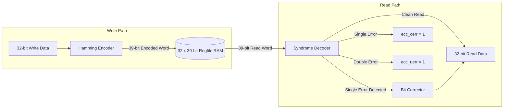

# SECDED ECC Register File

When compiled in the **SECURE** configuration (`SECURE = 1`), Kavacha replaces the standard register file with an error-resilient **SECDED (Single-Error Correction, Double-Error Detection) ECC Register File** (`kavacha_regfile_ecc.sv`).

This cell protects all 32 general-purpose registers (`x0`–`x31`) against **Single-Event Upsets (SEU)** caused by cosmic radiation, alpha particle strikes, or electromagnetic interference in radiation-sensitive and high-reliability environments.

---

## 1. Register Entry Width & Parity Layout

Each 32-bit register is stored alongside **7 Hamming check bits**, expanding the internal register width to **39 bits**:

```
39-bit ECC Register Storage Layout:
 38       32 31                                                  0
| Check Bits|                  32-Bit Data Word                   |
|  C6 .. C0 |                     D31 .. D0                       |
```

### Parity Math Parameters
* **Data Bits ($D$):** 32 bits
* **Parity Check Bits ($P$):** 6 Hamming bits ($2^6 = 64 \ge 32 + 6 + 1$)
* **Overall Parity Bit ($P_{\text{overall}}$):** 1 bit for double-error detection
* **Total Storage per GPR Entry:** $32 + 6 + 1 = \mathbf{39\text{ bits}}$

---

## 2. ECC Encoding & Read Correction Pipeline



---

## 3. Syndrome Calculation & Error Classification

On every register read cycle, the syndrome logic computes a 6-bit syndrome vector $S[5:0]$ and checks the overall parity bit $P_{\text{overall}}$:

$$S[i] = \text{Parity}_{\text{calculated}}[i] \oplus \text{Parity}_{\text{stored}}[i]$$

| Syndrome Vector ($S$) | Overall Parity | Status | Hardware Action |
|-----------------------|:--------------:|:------:|-----------------|
| $S = \text{6'b000000}$ | Match | **No Error** | Read data passed directly to execution datapath. |
| $S \ne \text{6'b000000}$ | Mismatch | **Single-Bit Error** | Bit index indicated by $S$ is flipped (`rdata[S] ^ 1'b1`). Corrected word passed to datapath; `ecc_cerr = 1` asserted. |
| $S \ne \text{6'b000000}$ | Match | **Double-Bit Error** | Uncorrectable double-bit corruption detected. `ecc_uerr = 1` asserted; triggers hardware fault handling. |

---

## 4. SystemVerilog Encoder & Decoder Functions (`kavacha_regfile_ecc.sv`)

The Hamming (39,32) check bits use 32 distinct 6-bit column codes (`hcol`):

```verilog
// 6 Hamming check bits + 1 overall parity = 7 ECC bits
function automatic logic [6:0] enc(input logic [31:0] d);
  logic [5:0] c; integer j;
  c = 6'd0;
  for (j = 0; j < 32; j = j + 1) c = c ^ (d[j] ? hcol(j) : 6'd0);
  enc = {(^d) ^ (^c), c};                       // {overall parity, check bits}
endfunction

// Decode & correct: returns {uerr, cerr, corrected_data[31:0]}
function automatic logic [33:0] dec(input logic [6:0] e, input logic [31:0] d);
  logic [5:0] c_re, s; logic perr; logic [31:0] dc; integer j;
  c_re = 6'd0;
  for (j = 0; j < 32; j = j + 1) c_re = c_re ^ (d[j] ? hcol(j) : 6'd0);
  s    = e[5:0] ^ c_re;                          // syndrome
  perr = (^e) ^ (^d);                            // total-parity mismatch (odd = single)
  dc   = d;
  for (j = 0; j < 32; j = j + 1)
    if (perr && (s == hcol(j))) dc[j] = ~d[j];   // correct flipped bit
  dec = {(~perr & (s != 6'd0)), perr, dc};       // {uncorrectable, corrected, data}
endfunction
```

---

## 5. Unit Verification & Fault Injection

The SECDED ECC register file ships with a dedicated self-checking testbench (`tb/tb_regfile_ecc.sv`) runnable directly from the build driver:

```bash
./build.sh ecc
```

### Testbench Fault Injection Routine
1. Writes test patterns to GPR registers `x1` through `x31`.
2. **Single-Bit Fault Injection:** Flips a bit of a register in RAM; verifies that reading yields corrected data and asserts `ecc_cerr = 1`.
3. **Double-Bit Fault Injection:** Flips two bits of a register in RAM; verifies that reading flags `ecc_uerr = 1`.
4. Output prints: `ECC PASS`.
