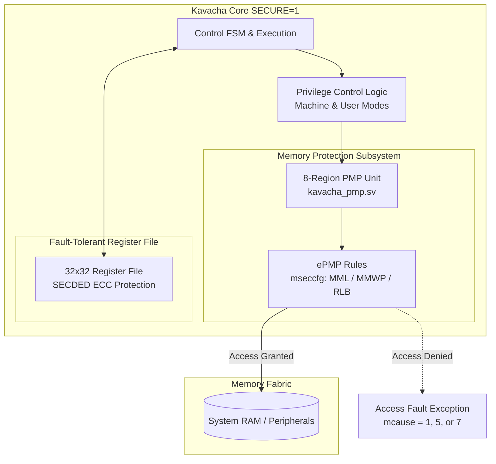

# Security Tier Overview & Architecture

Kavacha features an optional, hardware-enforced **Security Tier** enabled by setting the SystemVerilog parameter `parameter bit SECURE = 1` or defining `-DKAVACHA_SECURE` at compile time.

While the **Default Mode** (`SECURE = 0`) operates entirely in Machine (M) mode for minimal silicon footprint (~2,491 LUTs), the **SECURE Mode** (`SECURE = 1`) transforms Kavacha into a multi-tenant, fault-tolerant processor core suitable for secure boot ROMs, trusted execution environments (TEE), and safety-critical embedded systems (~4,362 LUTs).

---

## Default vs. SECURE Feature Matrix

| Architectural Feature | **Default Mode (`SECURE = 0`)** | **SECURE Mode (`SECURE = 1`)** |
|-----------------------|:------------------------------:|:-----------------------------:|
| **Supported Privilege Levels** | Machine (M) Mode Only | Machine (M) + User (U) Modes |
| **`misa` Register Output** | `32'h40001104` (RV32IMC) | `32'h40101104` (RV32IMCU, `U`-bit set) |
| **Memory Protection** | Unrestricted Access | 8-Region Hardware PMP Unit (`kavacha_pmp.sv`) |
| **Enhanced PMP (ePMP)** | — | Supported via `mseccfg` (`MML`, `MMWP`, `RLB`) |
| **Register File Architecture** | Plain 32×32-bit GPR File | SECDED ECC Protected (`kavacha_regfile_ecc.sv`) |
| **Error Detection / Correction** | — | Single-Bit Error Correction / Double-Bit Detection |
| **Synthesis Footprint (Artix-7 Core)** | **2,491 LUTs / 749 FFs** | **4,362 LUTs / 1,400 FFs** |
| **Synthesis Footprint (Artix-7 SoC)** | **2,816 LUTs / 1,335 FFs** | **5,226 LUTs / 1,980 FFs** |

---

## Security Architecture & Subsystem Block Diagram



---

## Threat Model & Security Defense Vectors

The SECURE tier is designed to mitigate key hardware- and software-level security threats:

| Threat Vector | Potential Impact | Security Tier Mitigation | Hardware Enforcement Mechanism |
|---------------|------------------|--------------------------|--------------------------------|
| **Software Privilege Escalation** | Untrusted application code modifies supervisor state | **User Privilege Isolation** | Untrusted code executes in User mode; instruction execution or CSR access above U-mode traps to Machine mode. |
| **Malicious Memory Injection** | Application code overwrites kernel RAM or execute stack | **8-Region PMP & ePMP** | PMP grants explicit `R`/`W`/`X` permissions per region. `MMWP` blocks all unmapped accesses. |
| **Machine-Mode Compromise** | Compromised M-mode supervisor code modifies secure ROM | **Machine Mode Lockdown (`MML`)** | Locked PMP regions (`L=1`) enforce read-only execution permissions on Machine mode as well as User mode. |
| **Radiation / Single-Event Upsets (SEU)** | Alpha particle flip in GPR corrupts pointer or data | **SECDED ECC Register File** | Every register write computes Hamming check bits. Reads automatically correct single-bit errors and flag double-bit errors. |

---

## Enabling the Security Tier

### RTL Instantiation
```verilog
kavacha_core #(
  .RESET_PC(32'h00000000),
  .SECURE  (1)  // Enable User Mode + 8-region PMP/ePMP + SECDED ECC
) u_kavacha_core (
  // Ports...
);
```

### Compiler / Build Script Flag
```bash
# Run PMP test suite under SECURE configuration
./build.sh pmp

# Run ePMP (mseccfg) test suite under SECURE configuration
./build.sh epmp

# Run SECDED ECC register file unit test
./build.sh ecc
```
