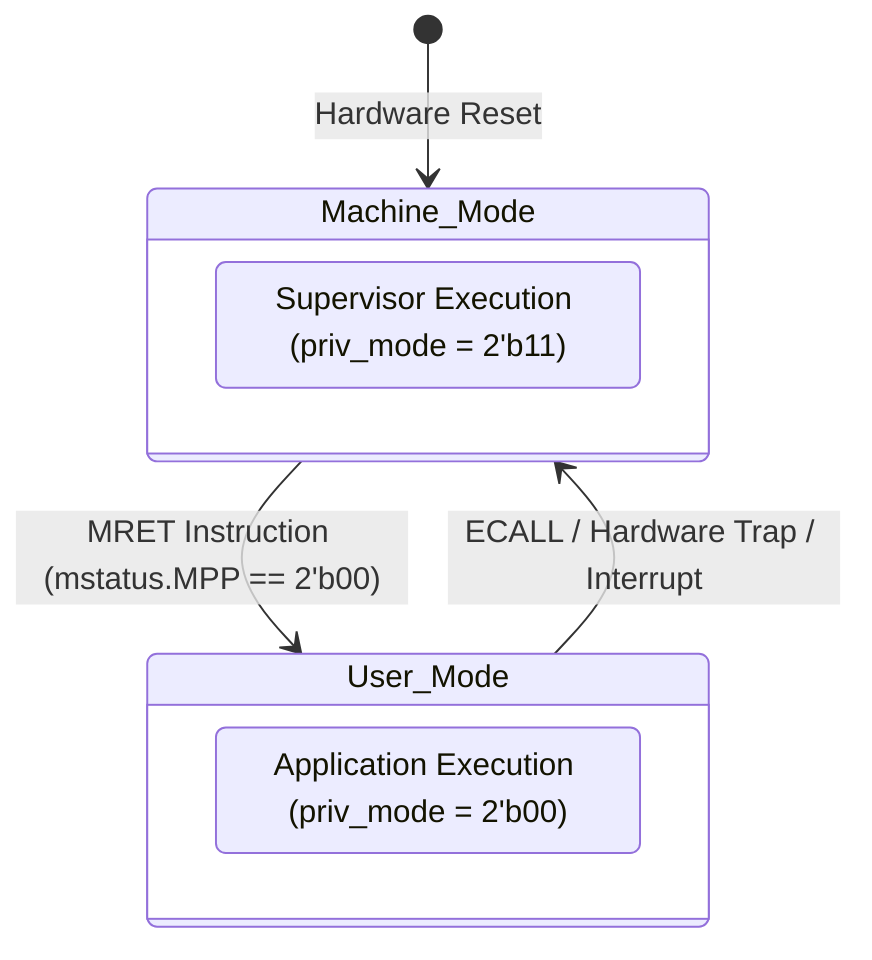

# User Privilege Mode & Transitions

When Kavacha is compiled in the **SECURE** configuration (`SECURE = 1` or `-DKAVACHA_SECURE`), the hardware instantiates two RISC-V privilege levels: **Machine mode (M-mode)** and **User mode (U-mode)**. 

This enables a two-tier software isolation model where a trusted Machine-mode supervisor isolates untrusted User-mode application tasks.

---

## 1. Privilege Levels & Architectural Capabilities

| Privilege Level | Encoding (`priv_mode[1:0]`) | Access Rights | Hardware Capabilities |
|-----------------|:---------------------------:|:-------------:|-----------------------|
| **Machine Mode (M-mode)** | `2'b11` | Highest Privilege / Supervisor | Unrestricted access to all CSRs, memory regions (unless locked by PMP/ePMP), traps, and system instructions (`MRET`, `WFI`). |
| **User Mode (U-mode)** | `2'b00` | Lowest Privilege / Application | Restricted execution. Access to Machine CSRs or system instructions is blocked. All memory accesses are subject to PMP checks. |

When `SECURE = 1`, `misa` bit 20 (`U` extension bit) is asserted high, reporting `misa = 32'h40101104`.

---

## 2. Privilege State Transitions & Trap Flow



---

## 3. Detailed Transition Semantics

### Dropping Privilege: Machine Mode → User Mode (`MRET`)

To launch or resume an untrusted User-mode application task, the Machine-mode supervisor executes the following sequence:

1. **Set Previous Privilege:** Writes `mstatus.MPP = 2'b00` (User mode).
2. **Set User Target PC:** Writes the entry address of the User program to `mepc`.
3. **Execute `MRET`:** The core executes the `MRET` instruction, triggering hardware state updates in `kavacha_csr.sv`:
   * `priv_mode <= mstatus.MPP` (`2'b00` - User Mode)
   * `mstatus.MIE <= mstatus.MPIE` (Restores global interrupt enable)
   * `mstatus.MPIE <= 1`
   * `mstatus.MPP <= 2'b00`
   * `pc <= mepc`

### Escalating Privilege: User Mode → Machine Mode (Trap / Exception / `ECALL`)

When a User-mode application executes `ECALL`, incurs a PMP access fault, or receives a hardware interrupt:

1. **Capture Return Address:** Hardware saves the address of the faulting/interrupted instruction into `mepc`.
2. **Record Cause & Value:** Hardware writes exception/interrupt code to `mcause` and fault info to `mtval`.
3. **Save Privilege State:**
   * `mstatus.MPP <= priv_mode` (`2'b00` - User Mode saved as previous privilege)
   * `mstatus.MPIE <= mstatus.MIE` (Saves global interrupt state)
   * `mstatus.MIE <= 0` (Disables nested interrupts)
4. **Escalate Privilege:** Hardware forces `priv_mode <= 2'b11` (Machine Mode).
5. **Vector Redirection:** PC updates to `next_pc = mtvec`.

---

## 4. SystemVerilog Privilege Control Logic (`kavacha_csr.sv`)

```verilog
// Privilege Level State Registers
logic [1:0] priv_mode_q, priv_mode_d;

// MRET Instruction Privilege Restoration Logic
always_comb begin
  priv_mode_d = priv_mode_q;
  if (mret_insn_act) begin
    priv_mode_d = mstatus_q.mpp; // Restore previous privilege level
  end else if (trap_entry_act) begin
    priv_mode_d = 2'b11;        // Escalate to Machine Mode on trap
  end
end
```

---

## 5. Hardware-Enforced Restrictions in User Mode

While executing in User mode (`priv_mode == 2'b00`), the hardware enforces strict restrictions:

| Restricted Action in User Mode | Hardware Reaction | Exception Generated |
|--------------------------------|-------------------|---------------------|
| Accessing Machine CSRs (`mstatus`, `mtvec`, etc.) | Suppresses read/write; traps | **Illegal Instruction** (`mcause = 32'h00000002`) |
| Executing `MRET` or `WFI` | Suppresses execution; traps | **Illegal Instruction** (`mcause = 32'h00000002`) |
| `ECALL` Instruction | Traps to Machine supervisor | **Environment Call from U-mode** (`mcause = 32'h00000008`) |
| Memory Fetch/Load/Store denied by PMP | Blocks memory request; traps | **Instruction/Load/Store Access Fault** (`mcause = 1, 5, or 7`) |
