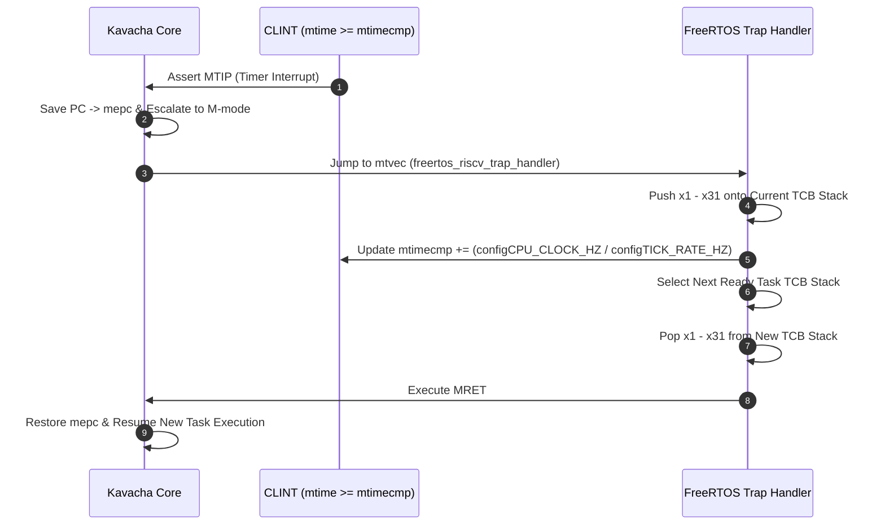

# Bare-Metal C & FreeRTOS Porting

Kavacha supports both bare-metal C applications and real-time operating systems (**FreeRTOS**). 

The core provides a standard RISC-V runtime initialization routine (`firmware/start.S`) and integrates directly with the official FreeRTOS GCC RISC-V port via the CLINT timer controller.

---

## 1. Bare-Metal C Runtime Initialization (`start.S`)

Before jumping to `main()`, the assembly startup code initializes registers, configures the stack, clears memory, and sets up trap vectors:

```s
/* Kavacha Startup Code (firmware/start.S) */
.section .text.init
.global _start
.type _start, @function

_start:
    /* 1. Clear architectural registers x1 - x31 */
    li x1,  0; li x2,  0; li x3,  0; li x4,  0
    li x5,  0; li x6,  0; li x7,  0; li x8,  0
    li x9,  0; li x10, 0; li x11, 0; li x12, 0
    li x13, 0; li x14, 0; li x15, 0; li x16, 0
    li x17, 0; li x18, 0; li x19, 0; li x20, 0
    li x21, 0; li x22, 0; li x23, 0; li x24, 0
    li x25, 0; li x26, 0; li x27, 0; li x28, 0
    li x29, 0; li x30, 0; li x31, 0

    /* 2. Initialize Stack Pointer to Top of RAM */
    la sp, _stack_top

    /* 3. Set Machine Trap Vector Address */
    la t0, trap_vector
    csrw mtvec, t0

    /* 4. Clear BSS Section */
    la t0, _bss_start
    la t1, _bss_end
1:  bge t0, t1, 2f
    sw zero, 0(t0)
    addi t0, t0, 4
    j 1b

2:  /* 5. Call C main() */
    call main

    /* 6. Terminate simulation via tohost */
3:  li t0, 0x20000000
    li t1, 1            /* 0x1 = PASS */
    sw t1, 0(t0)
    wfi
    j 3b
```

---

## 2. FreeRTOS Port Configuration (`FreeRTOSConfig.h`)

Kavacha uses the standard **FreeRTOS GCC RISC-V Port** (`Source/portable/GCC/RISC-V/`). `FreeRTOSConfig.h` maps OS tick timers directly to Kavacha's CLINT registers:

```c
/* FreeRTOS Configuration File (FreeRTOSConfig.h) */
#ifndef FREERTOS_CONFIG_H
#define FREERTOS_CONFIG_H

#define configMTIME_BASE_ADDRESS        ( 0x0200BFF8UL ) // CLINT mtime
#define configMTIMECMP_BASE_ADDRESS     ( 0x02004000UL ) // CLINT mtimecmp

#define configCPU_CLOCK_HZ              ( ( uint32_t ) 100000000 ) // 100 MHz
#define configTICK_RATE_HZ              ( ( TickType_t ) 1000 )    // 1000 Hz OS Tick (1 ms)

#define configMAX_PRIORITIES            ( 5 )
#define configMINIMAL_STACK_SIZE        ( ( unsigned short ) 128 )
#define configTOTAL_HEAP_SIZE           ( ( size_t ) ( 16 * 1024 ) ) // 16 KB Heap

#define configUSE_PREEMPTION            1
#define configUSE_TIME_SLICING          1
#define configUSE_IDLE_HOOK             0
#define configUSE_TICK_HOOK             0

#endif /* FREERTOS_CONFIG_H */
```

---

## 3. Preemptive Task Context Switch Flow



---

## 4. Multi-Tenant Task Isolation (`SECURE = 1`)

When compiled with `SECURE = 1`, FreeRTOS can execute application tasks in **User mode (`priv_mode = 2'b00`)**:

1. **Task Scheduling:** FreeRTOS kernel runs in Machine mode (`2'b11`).
2. **PMP Reconfiguration:** Before switching context to a User task, the OS configures PMP Region 0 (`pmpcfg0` / `pmpaddr0`) to grant access only to that specific task's stack and RAM region.
3. **Privilege Drop:** Kernel sets `mstatus.MPP = 2'b00` and executes `MRET`, launching the task in isolated User mode.
