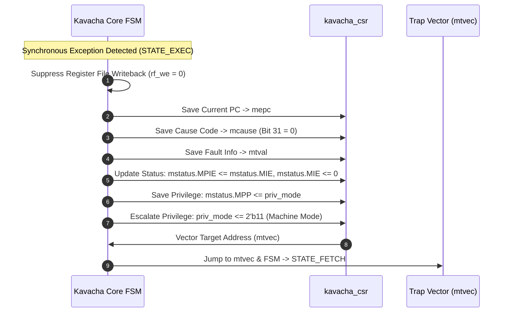

# Precise Exceptions & Traps

Kavacha guarantees **precise exceptions**. Because the core executes one instruction at a time through a multi-cycle state machine ($N_{\text{flight}} = 1$), the architectural state captured when an exception occurs is exact. There are no speculative execution pipelines, out-of-order buffers, or branch mispredictions to unwind.

---

## 1. Synchronous Exception Causes Table

When a synchronous exception occurs during `STATE_EXEC` or `STATE_LOAD`, the core traps to Machine mode and updates `mcause`:

| Exception Code (`mcause[30:0]`) | Exception Name | Triggering Condition | `mtval` Value Loaded |
|:------------------------------:|----------------|----------------------|----------------------|
| **1** | **Instruction Access Fault** | Instruction fetch address denied by 8-region PMP/ePMP | Faulting Instruction Address |
| **2** | **Illegal Instruction** | Unrecognized opcode, invalid funct3/7, write to read-only CSR, or U-mode privilege violation | 32-bit Faulting Instruction Word |
| **3** | **Breakpoint** | `EBREAK` instruction or Debug Module breakpoint trigger | Address of `EBREAK` instruction |
| **5** | **Load Access Fault** | Data memory load address denied by PMP/ePMP | Faulting Load Memory Address |
| **7** | **Store/AMO Access Fault** | Data memory store address denied by PMP/ePMP | Faulting Store Memory Address |
| **8** | **Environment Call from U-mode** | `ECALL` instruction executed in User Mode (`priv_mode == 2'b00`) | `32'h00000000` |
| **11** | **Environment Call from M-mode** | `ECALL` instruction executed in Machine Mode (`priv_mode == 2 mepc`) | `32'h00000000` |

---

## 2. Hardware Exception Entry Sequence



### Detailed State Operations
1. **Writeback Suppression:** The FSM immediately cancels register writeback (`rf_we = 0`).
2. **PC Preservation:** Current instruction PC is saved to `mepc`.
3. **Cause & Trap Value Capture:**
   * `mcause[31] = 0` (indicates a synchronous exception).
   * `mcause[30:0]` is set to the exception code.
   * `mtval` is loaded with the faulting address (access faults) or instruction word (illegal instructions).
4. **Privilege & Status Update:**
   * `mstatus.MPIE <= mstatus.MIE` (Saves global interrupt enable).
   * `mstatus.MIE <= 0` (Disables nested interrupts during trap entry).
   * `mstatus.MPP <= priv_mode` (Preserves previous privilege mode).
   * `priv_mode <= 2'b11` (Escalates to Machine mode).
5. **Vector Redirection:** The PC logic sets `next_pc = mtvec[31:2] << 2` and the FSM transitions directly to `STATE_FETCH`.

---

## 3. Hardware Exception Return Sequence (`MRET`)

To return from a trap handler, the Machine supervisor executes `MRET`. The core performs the following atomic state restoration:

```verilog
// MRET Hardware State Restoration Logic (kavacha_csr.sv)
always_ff @(posedge clk) begin
  if (rst) begin
    priv <= 2'b11;  // Start in M-mode
  end else if (mret) begin
    mstatus[MIE_BIT]  <= mstatus[MPIE_BIT]; // Restore global interrupt enable
    mstatus[MPIE_BIT] <= 1'b1;               // Re-enable previous interrupt flag
    if (U_MODE) begin
      priv           <= mstatus[12:11];       // Restore interrupted privilege
      mstatus[12:11] <= 2'b00;                // Reset MPP to U (least privilege)
      if (mstatus[12:11] != 2'b11)
        mstatus[17]  <= 1'b0;                 // MRET to <M clears MPRV
    end else begin
      mstatus[12:11] <= 2'b11;                // M-only: MPP stays M
    end
  end
end
```

* **PC Restoration:** `next_pc = mepc`.
* **FSM Transition:** Returns to `STATE_FETCH` to execute the instruction at `mepc`.

---

## 4. Hardware Misaligned Address Exception Handling

If hardware misaligned access support is disabled or cross-boundary memory beats are denied by PMP:

* **Instruction Address Misaligned:** If a jump/branch target has bit 0 set (`target[0] != 0`), an Instruction Address Misaligned exception is raised.
* **Load/Store Access Fault:** If a 2-beat misaligned access fails PMP permission check on either beat 1 or beat 2, a Load or Store Access Fault exception is raised with `mtval` holding the exact failing memory address.
