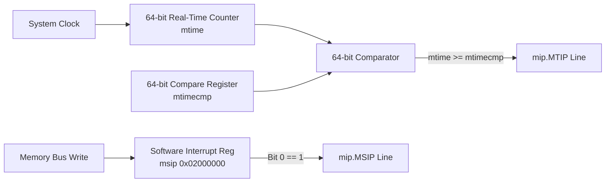

# Machine Interrupts & CLINT

Kavacha supports three standard asynchronous machine-mode interrupts: **Software Interrupts (MSIP)**, **Timer Interrupts (MTIP)**, and **External Interrupts (MEIP)**.

Interrupts are sampled at instruction boundaries (`STATE_EXEC` / `STATE_LOAD`) and gated by global status (`mstatus.MIE`) and individual enable bits in `mie`.

---

## 1. Interrupt Gating & Priority Logic

An interrupt is serviced if and only if:
1. Global interrupt enable is set: `mstatus.MIE == 1` (or core is running in User mode).
2. The specific interrupt enable bit in `mie` is set.
3. The interrupt pending line in `mip` is asserted high.

$$\text{ServiceInterrupt} = (\text{priv\_mode} == \text{U\_MODE} \lor \text{mstatus.MIE}) \land ((\text{mie.MEIE} \land \text{mip.MEIP}) \lor (\text{mie.MSIE} \land \text{mip.MSIP}) \lor (\text{mie.MTIE} \land \text{mip.MTIP}))$$

### Hardware Interrupt Priority
If multiple interrupt lines are pending simultaneously, Kavacha services them in strict hardware priority order:
1. **External Interrupt (`MEIP`)** — Highest Priority
2. **Software Interrupt (`MSIP`)** — Medium Priority
3. **Timer Interrupt (`MTIP`)** — Lowest Priority

---

## 2. Asynchronous Interrupt Cause Table

When an interrupt is taken, bit 31 of `mcause` is set to `1` to distinguish it from a synchronous exception:

| Interrupt Type | `mcause` Value (Hex) | `mcause` Exception Code | Interrupt Source |
|----------------|:--------------------:|:-----------------------:|------------------|
| **Machine Software Interrupt** | `0x80000003` | `3` | CLINT `msip` register bit 0 |
| **Machine Timer Interrupt** | `0x80000007` | `7` | CLINT `mtime` $\ge$ `mtimecmp` comparator |
| **Machine External Interrupt** | `0x8000000B` | `11` | External PLIC / Hardware interrupt line |

---

## 3. Core Local Interruptor (CLINT) Architecture

The reference SoC (`kavacha_soc.sv`) instantiates a RISC-V compliant **CLINT** module memory-mapped at `0x0200_0000`:



### CLINT Memory Map

| Register Name | Address | Bit Width | Access | Functional Description |
|---------------|:-------:|:---------:|:------:|------------------------|
| `msip0` | `0x0200_0000` | 32 | RW | Bit 0 controls software interrupt (`mip.MSIP`). Write `1` to trigger, `0` to clear. |
| `mtimecmp` | `0x0200_4000` | 64 | RW | 64-bit timer compare register. Assert `mip.MTIP` when `mtime >= mtimecmp`. |
| `mtime` | `0x0200_BFF8` | 64 | RO/RW | 64-bit real-time counter incrementing at fixed clock rate. |

---

## 4. Vectoring Modes (`mtvec.MODE`)

Kavacha supports both **Direct** and **Vectored** interrupt handling:

```
mtvec Register (0x305):
 31                                         2 1    0
|                BASE[31:2]                  | MODE |
```

### 1. Direct Mode (`mtvec.MODE == 2'b00`)
All interrupts and synchronous exceptions jump to the exact same base address:

$$\text{VectorAddress} = \{\text{mtvec.BASE}[31:2], 2'b00\}$$

### 2. Vectored Mode (`mtvec.MODE == 2'b01`)
Synchronous exceptions vector to `BASE`, while interrupts vector to an offset based on their cause code ($i$):

$$\text{VectorAddress}_{\text{Interrupt}} = \{\text{mtvec.BASE}[31:2], 2'b00\} + (i \times 4)$$

| Interrupt Cause ($i$) | Vector Target Address in Vectored Mode |
|:---------------------:|----------------------------------------|
| Software Int ($i=3$) | `mtvec.BASE + 0x0C` |
| Timer Int ($i=7$) | `mtvec.BASE + 0x1C` |
| External Int ($i=11$) | `mtvec.BASE + 0x2C` |

---

## 5. Interrupt Response Latency & Servicing

```
CLK              :   _   / \   _   / \   _   / \   _   / \   
Interrupt Line   :  ____[  MEIP HIGH  ]_____________________
FSM State        :  [ STATE_EXEC ][ STATE_FETCH (mtvec Target) ]
pc               :  [   0x0004   ][       0x00000100           ]
mepc             :  _____________[   Saved 0x0008              ]
```

1. **Sampling:** Interrupt lines are sampled continuously. If an interrupt asserts during `STATE_EXEC`, the FSM completes the current instruction.
2. **Trap Entry:** Upon instruction retirement, the core captures `mepc = next_pc`, sets `mcause[31] = 1`, and redirects `pc` to the interrupt vector in **2 clock cycles**.
3. **Servicing Bounds:** Maximum interrupt entry latency is bounded by the longest atomic execution cycle (34 cycles for hardware division) $+ 2$ cycles.
