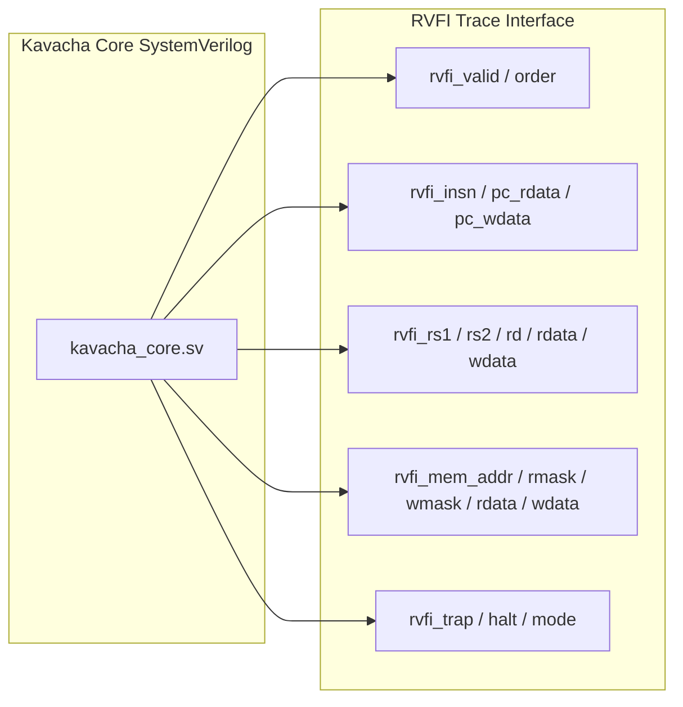

# RVFI Formal Verification & Compliance

Kavacha incorporates the standard **RISC-V Formal Interface (RVFI)** directly within `kavacha_core.sv`. 

RVFI exposes execution trace signals on every instruction retirement, enabling automated formal verification with SymbiYosys/Yosys and 100% compliance testing against the official RISC-V Architectural Compliance Test Suite (`riscv-tests`).

---

## 1. RISC-V Formal Interface (RVFI) Port Specification

When an instruction retires (`STATE_EXEC`, `STATE_LOAD`, or `STATE_MD`), the core asserts `rvfi_valid = 1` for 1 clock cycle and presents the full architectural retirement record:



### Complete RVFI Port Table (`kavacha_core.sv`)

| RVFI Signal Name | Direction | Bit Width | Description |
|------------------|:---------:|:---------:|-------------|
| `rvfi_valid` | Output | 1 | Asserted high for 1 cycle when an instruction retires |
| `rvfi_order` | Output | 64 | Monotonically increasing instruction retirement index |
| `rvfi_insn` | Output | 32 | Executed 32-bit instruction word (expanded if RVC) |
| `rvfi_trap` | Output | 1 | Asserted if the instruction raised a trap/exception |
| `rvfi_halt` | Output | 1 | Asserted if the instruction halted the core |
| `rvfi_mode` | Output | 2 | Privilege level during execution (`2'b11` = M, `2'b00` = U) |
| `rvfi_rs1_addr` | Output | 5 | Source register 1 address (`rs1`) |
| `rvfi_rs2_addr` | Output | 5 | Source register 2 address (`rs2`) |
| `rvfi_rs1_rdata` | Output | 32 | Read data value from `rs1` |
| `rvfi_rs2_rdata` | Output | 32 | Read data value from `rs2` |
| `rvfi_rd_addr` | Output | 5 | Destination register address (`rd`) |
| `rvfi_rd_wdata` | Output | 32 | Data written back to `rd` (0 if `rf_we == 0`) |
| `rvfi_pc_rdata` | Output | 32 | PC of the retired instruction |
| `rvfi_pc_wdata` | Output | 32 | Target PC for the next instruction |
| `rvfi_mem_addr` | Output | 32 | Target memory address (if load/store) |
| `rvfi_mem_rmask` | Output | 4 | Byte read mask (`dmem_re` byte lanes) |
| `rvfi_mem_wmask` | Output | 4 | Byte write mask (`dmem_be[3:0]`) |
| `rvfi_mem_rdata` | Output | 32 | Raw data read from memory |
| `rvfi_mem_wdata` | Output | 32 | Raw data written to memory |

---

## 2. Official RISC-V Architectural Compliance Test Suite

Kavacha is verified against the official **RISC-V Architectural Compliance Test Suite (`riscv-tests`)**:

```bash
# Run complete RISC-V compliance suite
./build.sh isa
```

### Test Suite Test Matrix & Compliance Results

| Test Category | Suite Name | Tests Executed | Status |
|---------------|------------|:--------------:|:------:|
| **RV32I Base Integer** | `rv32ui-p-*` | 38 tests (`add`, `sub`, `and`, `or`, `sll`, `srl`, `sra`, `slt`, `lui`, `auipc`, `jal`, `jalr`, `beq`, `bne`, `blt`, `bge`, `lb`, `lh`, `lw`, `sb`, `sh`, `sw`, etc.) | **PASS** |
| **M Hardware Math** | `rv32um-p-*` | 8 tests (`mul`, `mulh`, `mulhsu`, `mulhu`, `div`, `divu`, `rem`, `remu`) | **PASS** |
| **C Compressed** | `rv32uc-p-*` | 6 tests (RVC compressed instruction expansions) | **PASS** |
| **Machine Privilege** | `rv32mi-p-*` | 8 tests (`csr`, `mbreakpoint`, `scall`, `illegal`, `ma_addr`, etc.) | **PASS** |
| **Total Passed** | — | **60 / 60 Tests** | **100% PASS** |

---

## 3. Formal Property Verification (SymbiYosys)

Using `riscv-formal` with Yosys and SymbiYosys, Kavacha is formally proven against the following properties:

1. **`pc_checks`:** Program counter increments correctly by 2 or 4, or updates to branch/jump target without gaps.
2. **`gpr_checks`:** Register file writes and reads match architectural expectations for all registers `x1`–`x31`. Register `x0` is proven to remain constant zero.
3. **`lsu_checks`:** Memory load alignment, store byte enables, and sign-extensions are proven correct for all combinations of `dmem_addr[1:0]`.
4. **`causal_checks`:** $N_{\text{flight}} = 1$ is formally proven; no internal state can mutate out of order.
